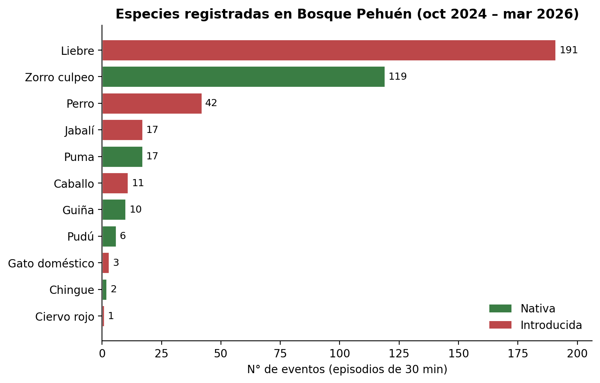
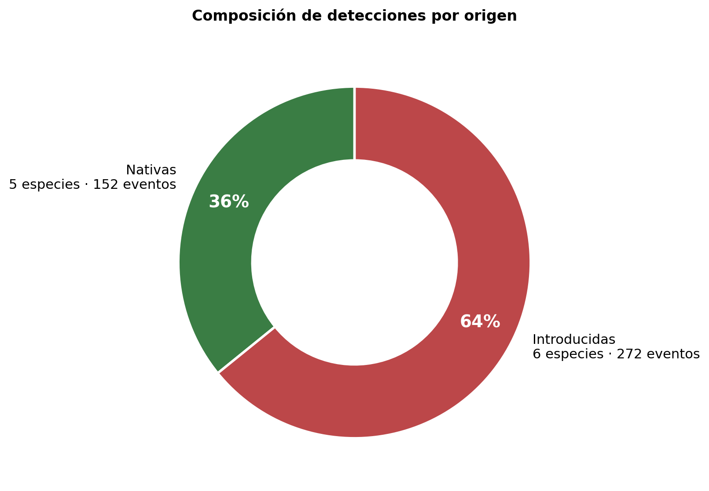
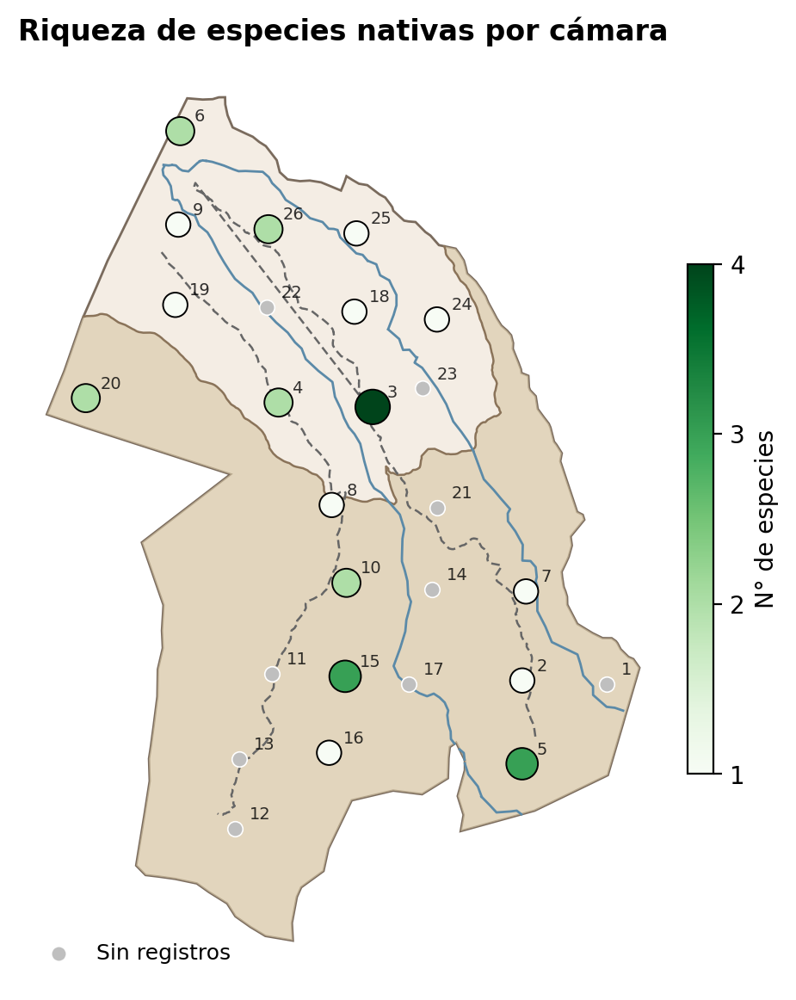
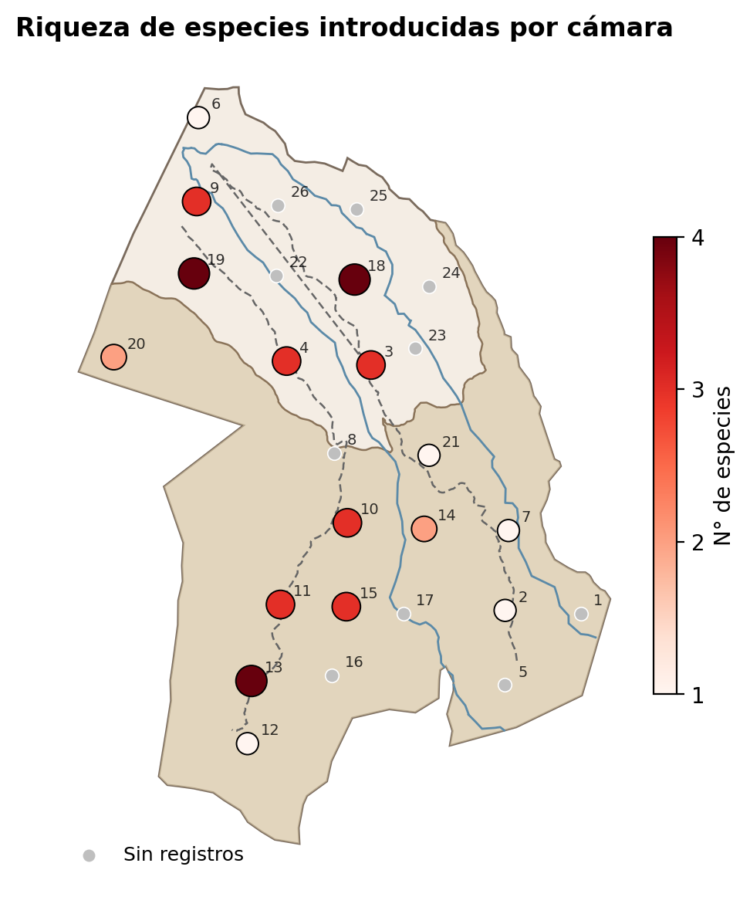
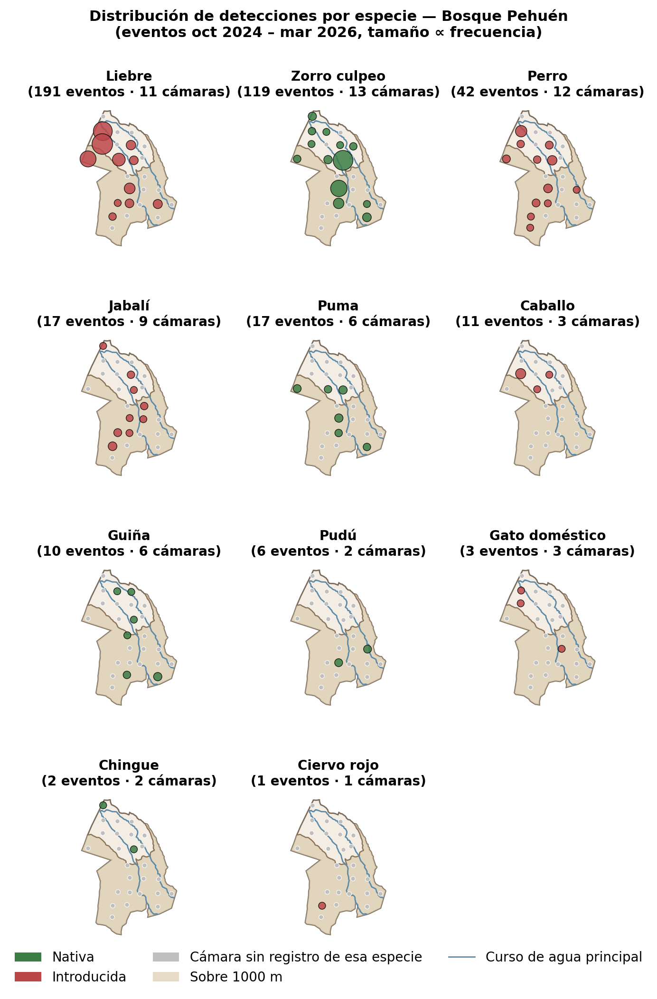

# 1. Antecedentes

## 1.1 Programa de fotomonitoreo y transición a metodología CONAF

El programa de fotomonitoreo en Bosque Pehuén (BP) opera de manera continua desde 2022, originalmente con una red de cámaras trampa (CT) instaladas en sitios fijos definidos en 2021 por investigadores de la Universidad Católica de Temuco. Los resultados acumulados entre marzo 2022 y octubre 2024 fueron reportados en el *Informe 2022–2024*.

A partir de **octubre de 2024** se reformuló la red bajo el diseño metodológico propuesto por CONAF para fotomonitoreo en áreas SNASPE, ajustado a las condiciones de BP. El presente informe cubre la primera fase completa de operación bajo esta metodología: tres campañas consecutivas entre octubre de 2024 y marzo de 2026.

## 1.2 Instalación y configuración de las cámaras trampa

El diseño CONAF, basado en *TEAM Network* (2017), define una grilla de puntos de muestreo aleatorios sobre la superficie útil del área. En BP, la red operativa actual consta de **26 cámaras trampa instaladas** sobre puntos seleccionados desde una grilla con separación mínima de 500 m, excluyendo zonas con pendiente superior a 45°. La meta de diseño es de 30 cámaras anuales; las 4 restantes se incorporarán en campañas futuras.

Cada CT permanece instalada de forma continua a lo largo del año, capturando datos durante todas las estaciones, con revisiones periódicas para cambio de tarjetas SD y de pilas. Los criterios de configuración aplicados son los siguientes:

- **Altura de instalación:** 30–40 cm sobre el suelo durante primavera, verano y otoño. **Durante invierno las cámaras se elevan a 1.7–2.0 m** para evitar que queden enterradas por la nieve.
- **Orientación:** mira hacia el sur, para evitar disparos vacíos causados por la luz directa del sol.
- **Atractores:** no se utilizan.
- **Distanciamiento:** mínimo 0.5 km entre cámaras.
- **Régimen de captura:** 3 imágenes + 1 video de 15 segundos por disparo (modelos Bushnell 119949C y 119875).

La tabla 1 resume el inventario de las 26 cámaras actualmente operativas, incluyendo coordenadas e identificador de grilla. Sus ubicaciones canónicas se encuentran en `plataforma-territorial/data/camera_trap_stations.geojson`.

## 1.3 Período cubierto y campañas incluidas

El informe agrega los resultados de tres campañas:

| Campaña | Período | N° eventos |
|---|---|---:|
| Otoño 2025 | oct 2024 – may 2025 | 210 |
| Primavera 2025 | jun 2025 – nov 2025 | 83 |
| Primavera-Verano 2025–2026 | dic 2025 – ene 2026 *(en curso)* | 126 |
| **Total** | | **419** |

> Cada evento se atribuye a la campaña que contiene su **primer** registro temporal. Las imágenes que aparecen replicadas entre las campañas Primavera 2025 y Primavera-Verano 2025–2026 (por re-revisión humana del mismo lote de fotografías) se colapsan en un único evento bajo la regla de 30 minutos. Esta dedup­licación, junto con la verificación visual descrita en la sección 1.6, modifica el conteo total con respecto a versiones preliminares del informe.

> La campaña Primavera-Verano 2025–2026 se encuentra aún en desarrollo al cierre de este informe; sólo se procesaron los registros recibidos hasta el 10 de enero de 2026. Sus cifras aumentarán al cerrarse la campaña en marzo de 2026.

> **Nota sobre fechas:** un subconjunto de las cámaras presentó errores en su reloj interno, registrando timestamps con año 2017. Estos fueron corregidos comparando los registros con la *Fecha de instalación* documentada en el `Registro de monitoreo CT.xlsx`. Para CT15 y CT16 se aplicó un desfase fijo de +8 años. Para CT19, anclamos el primer registro a su fecha de instalación (2025-01-30 14:12) y desplazamos el resto en bloque. Para la cámara TC16 en las campañas de Primavera y Primavera-Verano, los registros con fecha 2017 corresponden a un período pre-redespliegue cuya fecha real no pudo reconstruirse; estos 71 registros se excluyeron del análisis.

## 1.4 Definición de episodio independiente

Una cámara trampa puede capturar múltiples imágenes consecutivas del mismo individuo en un intervalo corto, lo que distorsiona los conteos de abundancia. Para evitar el doble conteo definimos el **episodio independiente** como la unidad mínima de análisis: todas las imágenes de una misma especie tomadas por una misma cámara en intervalos menores a **30 minutos** se cuentan como un único evento (O'Brien 2011; Meek et al. 2014).

Este criterio se aplica de forma consistente sobre todo el conjunto de datos. Los resultados que se reportan en este informe (gráficos y mapas) están expresados en eventos, no en imágenes individuales.

## 1.5 Procesamiento de imágenes y umbral de detección

El flujo de trabajo para procesar las imágenes capturadas se compone de tres etapas:

1. **Detección automática de animales** mediante MegaDetector V5a (Microsoft AI for Good Lab) sobre todas las imágenes capturadas.
2. **Clasificación zero-shot por especie** mediante CLIP, restringida a las imágenes con detección de animal.
3. **Revisión humana** de la clasificación CLIP en una interfaz Streamlit, con la opción de confirmar, corregir o rechazar la etiqueta sugerida.

Para la etapa 1 se requiere fijar un **umbral de confianza** que separa imágenes con animal de imágenes vacías. Una evaluación interna del desempeño de MegaDetector sobre 7.136 imágenes de BP (años 2022–2023, ver *Informe de desempeño MegaDetector V5*, 2026) mostró que el modelo entrega resultados marcadamente inferiores a los reportados por Velez & Fieberg (2022) para otras regiones —probablemente por la baja representación de ecosistemas chilenos en sus datos de entrenamiento—, lo que obliga a una calibración local.

Dado que el objetivo del fotomonitoreo en BP es maximizar la riqueza de especies registrada, se priorizó la **exhaustividad** (*recall*) sobre la precisión: se fijó un umbral de confianza de **0.38**, que entrega un *recall* de 0.97, una precisión de 0.80 y un puntaje F1 de 0.88. En la práctica esto significa que el modelo identifica correctamente el 97% de las imágenes con animales reales, al costo de incorporar algunos falsos positivos (ramas, sombras) que son filtrados en la revisión humana posterior. Esta decisión es consistente con el protocolo de control de calidad sugerido por Silva-Rodríguez et al. (2025).

## 1.6 Revisión visual de especies prioritarias

Tras una primera lectura del informe se identificó que dos especies —**Ciervo rojo** (*Cervus elaphus*) y **Güiña** (*Leopardus guigna*)— presentaban una distribución espacial llamativamente amplia para lo que se conocía del área. Como control adicional de calidad, se ejecutó una **revisión visual imagen por imagen** de las 37 detecciones etiquetadas con esas dos especies en las tres campañas (16 etiquetas de ciervo + 21 de güiña, antes de aplicar dedup­licación entre campañas y filtros de ventana temporal).

El protocolo fue el siguiente:

1. Generar el listado completo de imágenes etiquetadas como *Cervus elaphus* o *Leopardus guigna* en los CSV de revisión humana de las tres campañas, junto con la ruta de cada miniatura sobre disco (`Anual-reports/2025/data/manual_review_ciervo_guina.csv`).
2. Revisión visual de cada imagen por el equipo de fotomonitoreo (Felipe Guarda, junio 2026).
3. Para cada detección, registrar veredicto (*Verdadero* / *Falso*) y, en caso de *Falso*, la especie real observada en la imagen. El registro completo está en `Anual-reports/2025/data/manual_review_verdicts_2026-06-02.csv`.
4. Aplicar las correcciones a los registros, recomputar los eventos bajo la regla de 30 minutos y regenerar todas las figuras (`Anual-reports/2025/py/apply_verdicts.py`).

El resultado fue que la mayor parte de las detecciones de Ciervo rojo correspondían en realidad a otras especies (Liebre, Pudú, Jabalí, Zorro culpeo, Puma) y que una detección de Güiña era un disparo en falso sin animal. La especie más afectada fue **Ciervo rojo**, cuya presencia pasó de 7 cámaras a 1 (CT13); los detalles cuantitativos se incorporan a las cifras del resto del informe.

Esta revisión visual se aplicó únicamente a las dos especies bajo sospecha. Una auditoría visual sistemática de todas las etiquetas queda como tarea pendiente para futuras versiones del informe, junto con la incorporación de un protocolo de revisión cruzada (dos revisores independientes) descrito por Silva-Rodríguez et al. (2025).

## 1.7 Capas de contexto geográfico en los mapas

A partir de esta versión del informe, los mapas de distribución (figuras 3 a 6) incorporan tres capas de contexto que ayudan a interpretar los patrones de detección:

- **Gradiente altitudinal simplificado.** Se distinguen dos zonas dentro del polígono de BP: zona **baja** (por debajo de 1000 m s.n.m.) y zona **alta** (sobre 1000 m). De las 26 cámaras instaladas, **15 se ubican en zona alta y 11 en zona baja**; el rango altitudinal de la red es 861–1270 m. Las cámaras de zona baja se concentran exclusivamente en el sector norte (entrada del predio) y un sector adyacente noroeste, lo que coincide con el acceso vehicular: el camino sube desde la zona baja del norte hacia el resto del predio sin volver a descender. La zona alta y la línea divisoria de 1000 m se derivan de las curvas de nivel del área entregadas por el equipo FMA/ICN, recortadas al polígono de BP. La clasificación coincide con las altitudes GPS de las 26 cámaras.
- **Cursos de agua principales.** Los dos esteros principales del área (Estero la cascada y Estero San Marcos) se dibujan en azul.
- **Caminos vehiculares principales.** Se muestran sólo los dos caminos vehiculares de penetración: Puma y Araucarias. Se omite intencionalmente el ramal de servicio en torno a la zona de guardería (caminos vecinales y senderos peatonales) para no saturar el mapa.

Las capas de contexto se cargan desde `plataforma-territorial/data/basemap/` y se generan una sola vez con `py/00_prepare_basemap.py` a partir de los shapefiles de origen entregados por el equipo de FMA/ICN. La carpeta resultante también queda disponible para uso de la plataforma territorial.

---

# 2. Listado de especies

Tras aplicar el filtro de episodio independiente, la exclusión de aves y micromamíferos (justificada en la sección 1.5: insuficientes observaciones para análisis cuantitativo significativo en esta primera fase) y la verificación visual descrita en 1.6, se registraron **11 especies** de mamíferos medianos y grandes en Bosque Pehuén durante el período del informe. La tabla 2 resume el listado, indicando nombre común, nombre científico y origen (nativa / introducida).

**Tabla 2.** Listado de especies registradas (oct 2024 – mar 2026).

| Especie | Nombre científico | Origen |
|---|---|---|
| Zorro culpeo | *Lycalopex culpaeus* | Nativa |
| Puma | *Puma concolor* | Nativa |
| Güiña | *Leopardus guigna* | Nativa |
| Pudú | *Pudu puda* | Nativa |
| Chingue | *Conepatus chinga* | Nativa |
| Liebre europea | *Lepus europaeus* | Introducida |
| Jabalí | *Sus scrofa* | Introducida |
| Ciervo rojo | *Cervus elaphus* | Introducida |
| Caballo | *Equus caballus* | Introducida (doméstico) |
| Perro | *Canis lupus familiaris* | Introducida (doméstico) |
| Gato doméstico | *Felis catus* | Introducida (doméstico) |

De las 11 especies, **5 son nativas** (de las cuales tres —Puma, Güiña y Pudú— son prioritarias para la conservación) y **6 son introducidas**.

---

# 3. Especies más observadas

La figura 1 ordena las 11 especies por número de eventos durante el período del informe. Liebre europea (191 eventos) y Zorro culpeo (119) concentran el **74% del total de detecciones**. Tres especies introducidas (Liebre, Perro, Jabalí) explican el **60% de los eventos**.

{#fig:01_top_species width=80%}

A pesar de la dominancia numérica de introducidas, la riqueza específica está repartida casi equitativamente: 5 especies nativas y 6 introducidas. En términos de eventos totales, las introducidas representan el **63%** de las detecciones (figura 2).

{#fig:02_native_introduced width=60%}

---

# 4. Distribución espacial — mapas de riqueza

## 4.1 Mapa de riqueza total

La figura 3 muestra el número de especies registradas en cada cámara trampa durante el período del informe. **CT3** presenta la mayor riqueza (7 especies), seguida por **CT15** (6 especies). Cuatro cámaras (CT1, CT17, CT22, CT23) no registraron eventos retenidos en este análisis, indicadas como puntos grises.

Las cámaras con mayor riqueza se distribuyen entre las dos zonas altitudinales: CT3 (998 m) y CT18 (978 m) están en la zona baja del sector norte, mientras que CT15 (1118 m), CT5 (1270 m), CT10 (1135 m) y CT16 (1126 m) se ubican sobre los 1000 m. CT3 y CT15 —las dos cámaras con mayor riqueza acumulada— se ubican en posiciones cercanas a los cursos de los esteros principales, lo que sugiere que el acceso al agua opera como un factor que agrega múltiples especies en un mismo sector.

{#fig:03_richness_total width=85%}

## 4.2 Mapa de riqueza de especies nativas

CT3 es la única cámara que registró 4 especies nativas distintas; CT15 y CT5 alcanzaron 3. Las nativas se concentran preferentemente en el sector central y sur del área (figura 4): dos de las tres cámaras con mayor riqueza nativa están en zona alta (CT5 a 1270 m y CT15 a 1118 m) y CT3 está apenas por debajo del umbral (998 m), cerca de la confluencia visible de los esteros principales.

{#fig:04_richness_nativas width=85%}

## 4.3 Mapa de riqueza de especies introducidas

CT13, CT18 y CT19 muestran la mayor riqueza de introducidas (4 especies cada una; figura 5). El patrón espacial es heterogéneo, pero coincide con vías de acceso al área y zonas con uso humano frecuente: CT18, CT19 y CT9 se ubican en el sector de la entrada del predio, en zona baja y próximos al camino vehicular Puma. CT13 está en la mitad sur del predio, sobre los 1000 m, en un sector accesible por el camino vehicular Araucarias. La concentración de cámaras con ≥3 introducidas a lo largo de los caminos vehiculares (Puma en el norte, Araucarias en el sur) es notoria al comparar las figuras 4 y 5: independiente de la altitud, las especies asociadas a actividad humana (Liebre, Perro, Caballo) se ven preferentemente cerca de las vías de penetración.

> **Contexto operativo importante:** CT19 está ubicada cerca de las viviendas de los guardaparques, lo que explica el alto número de eventos en su entorno —principalmente caballos, perros y liebres— en una ventana temporal corta (cinco días de operación corregida). Esta cámara aparece como un *hotspot* en los mapas de riqueza de introducidas y en los paneles por especie de Liebre, Perro y Caballo.

{#fig:05_richness_introducidas width=85%}

## 4.4 Distribución por especie

La figura 6 muestra un panel de mini-mapas, uno por especie, con el tamaño de cada burbuja proporcional al número de eventos en esa cámara. Permite comparar visualmente la cobertura espacial de cada especie en BP, incluyendo el gradiente altitudinal y los cursos de agua principales como contexto.

Tras la verificación visual (sec. 1.6), **Ciervo rojo** queda registrado en una única cámara (CT13, en zona alta a 1172 m), con un sólo evento independiente. La **Güiña** se registra en 6 cámaras (CT3, CT5, CT8, CT16, CT25, CT26), tres en zona alta (CT5, CT8, CT16) y tres en zona baja (CT3, CT25, CT26), varias de ellas próximas a los esteros principales. El **Pudú** aparece sólo en zona alta (CT7 a 1232 m y CT15 a 1118 m), consistente con su preferencia por bosque siempreverde de altitud. El **Puma** se concentra en zona alta (CT5, CT10, CT15, CT20) con dos registros en zona baja (CT3 a 998 m y CT4 a 1004 m, este último justo bajo el contorno). En el grupo de introducidas, **Liebre europea** y **Perro** ocupan ambas zonas y se asocian fuertemente con los caminos vehiculares (CT9, CT11, CT13, CT15, CT18, CT19, CT20 todas próximas a los trazados de Puma o Araucarias). El **Caballo** se concentra en tres cámaras vinculadas a la red vial (CT4, CT18, CT19). El resto de las nativas e introducidas mantiene su distribución espacial sustancialmente sin cambios respecto del prep­rocesado automático.

{#fig:06_panel_especie width=100%}

---

# 5. Consideraciones

- **Cobertura de la red.** Las 26 CT instaladas representan el 87% de la meta de diseño de 30 cámaras. Cuatro cámaras (CT1, CT17, CT22, CT23) no aportaron datos al análisis durante el período cubierto; se priorizará revisar su funcionamiento en la próxima campaña.
- **Aves y micromamíferos.** Su exclusión en este informe responde al bajo número de detecciones registrado durante el período, no a su ausencia en el área. Próximas iteraciones del informe podrán incorporarlos a medida que se acumule volumen de datos suficiente.
- **Errores de reloj.** Las correcciones aplicadas a CT15, CT16 y CT19 fueron documentadas en el registro de procesamiento (`data/prep_log.txt`). Es recomendable revisar la configuración inicial del reloj y las pilas en la próxima campaña de instalación, y verificar el timestamp directamente en terreno antes de dejar cada cámara operativa.
- **Datos no recuperados.** El despliegue identificado como `100EK113` (252 imágenes en la campaña Primavera 2025) no pudo asociarse a una CT específica en el flujo automático; evidencia visual posterior sugiere que corresponde físicamente a CT5 (ver `Sessions/2026-05-27-camera-traps-ciervo-guina-ct-validation.md`), pero su reincorporación queda pendiente de confirmación adicional. Asimismo, 71 registros de la cámara TC16 con fecha 2017 que corresponden a un período pre-redespliegue no se incluyeron.
- **Calidad de etiquetado y revisión cruzada.** La revisión visual descrita en la sección 1.6 reveló que la clasificación CLIP + revisión humana inicial produjo una tasa de falsos positivos no despreciable para *Cervus elaphus* (10 de 16 etiquetas, ~63%) y muy baja para *Leopardus guigna* (1 de 21, ~5%). El detalle por imagen está en `data/manual_review_verdicts_2026-06-02.csv` y el resumen de impacto en `data/corrections_report.md`. Se recomienda aplicar este protocolo de verificación visual al resto de las especies prioritarias en futuras campañas, y considerar un esquema de revisión cruzada (dos revisores) que reduzca la varianza entre pases de revisión humana.

---

# Referencias

- **CONAF.** Diseño metodológico para fotomonitoreo en Áreas SNASPE *(documento interno revisado, 2026).*
- **Meek, P. D., et al.** (2014). *Recommended guiding principles for reporting on camera trapping research.* Biodiversity and Conservation, 23(9), 2321–2343.
- **O'Brien, T. G.** (2011). *Abundance, density and relative abundance: a conceptual framework.* En *Camera Traps in Animal Ecology* (Springer).
- **Silva-Rodríguez, E. A., Cortés, E. I., Vasquez-Ibarra, V., Gálvez, N., Cusack, J., Ohrens, O., Moreira-Arce, D., Farías, A. A., & Infante-Varela, J.** (2025). *A protocol for error prevention and quality control in camera trap datasets.* Journal of Applied Ecology, 00, 1–10. <https://doi.org/10.1111/1365-2664.70010>.
- **TEAM Network.** (2017). *Terrestrial Vertebrate Monitoring Protocol.* Conservation International.
- **Velez, J., & Fieberg, J.** (2022). *Guide for using artificial intelligence platforms for camera-trap data processing.* <https://ai-camtraps.netlify.app/>

---

*Datos y código fuente:* `camera-traps/Anual-reports/2025/`. Para regenerar las cifras: `python py/01_data_prep.py && python py/apply_verdicts.py && python py/02_figures_tables.py`. Las capas de contexto geográfico se generan una sola vez con `python py/00_prepare_basemap.py` (requiere `shapely`, `pyproj`, `pyshp`).
