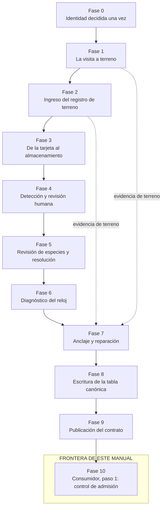

# Salud de los Datos de Cámaras Trampa

### Manual de extremo a extremo: del terreno al contrato

**Fundación Mar Adentro · Bosque Pehuén**
Documento vigente. Edición 2026-09-03.

> Este es el documento autoritativo. Existe una edición en inglés
> (`DATA-HEALTH-MANUAL.md`) que **no se mantiene al día** y que sólo debe usarse como
> referencia histórica.

---

## Parte 0 — Cómo usar este manual

### 0.1 Qué es esto

Es un **protocolo con su razonamiento adjunto**. Cada regla existe porque saltársela
destruye una medición concreta, y cada regla se enuncia junto a la medición que protege.

No es un tutorial del software. El `README.md` del repositorio es la guía comando por
comando; este manual apunta a él en lugar de repetirlo.

Lea la Parte 0 completa antes de cualquier otra cosa. Después de eso puede entrar
directamente a la fase que le interesa: cada una es autocontenida y empieza diciendo dónde
está usted parado y qué se decidió antes de llegar ahí.

### 0.2 El mapa completo — lea esto antes que nada

El problema práctico de un documento como éste no es la falta de detalle: es que uno pierde
de vista **dónde está** en la cadena. Once fases, cada una con su vocabulario, y a la
tercera ya no se sabe si "el segmento" es algo del terreno o algo del código.

Así que primero el mapa, y todo lo demás cuelga de él.

Cada fase es un **cambio de custodia o de forma** de los datos. No son etapas de un programa;
son los puntos donde algo se transforma y por lo tanto donde algo puede corromperse.



En forma de tabla, con lo que entra, lo que sale, y **de quién es la decisión**:

| # | Fase | Entra | Sale | Decisión que le pertenece |
|---|---|---|---|---|
| **0** | Identidad decidida una vez | — | registro de estaciones, alias | Cómo se llama una estación, y dónde está |
| **1** | La visita a terreno | el sitio | la hoja de visita llena | Qué se observó, en palabras crudas |
| **2** | **Ingreso del registro de terreno** | la planilla Excel | `field_notes.csv` | Que lo escrito en terreno entre sin perderse ni reinterpretarse |
| **3** | De la tarjeta al almacenamiento | tarjeta SD | carpetas por estación + manifiesto | Integridad estructural: conservación, orden de captura, atribución |
| **4** | Detección y revisión humana | imágenes | una categoría por imagen | Que **ninguna** imagen quede sin categoría |
| **5** | Revisión de especies y resolución | categorías | identificaciones | Qué es una especie identificada y qué no |
| **6** | **Diagnóstico del reloj** | marcas de tiempo | segmentos + veredictos | Si se le puede creer a cada tramo del reloj |
| **7** | Anclaje y reparación | veredictos + evidencia de terreno | desfases aplicados | Qué se repara, con qué testigo, y qué se rechaza |
| **8** | Escritura de la tabla canónica | todo lo anterior | `observations.parquet` | Una tabla, una gramática, con banderas de validez |
| **9** | Publicación del contrato | la tabla | `CANONICAL_STATE.json` | Una afirmación verificable de lo que se escribió |
| **10** | **Consumidor, paso 1: control de admisión** | el contrato | aceptar o rechazar | Si lo que llegó es lo que se publicó |

Dos propiedades del orden son deliberadas, y conviene fijarlas ahora porque explican la
mitad de las reglas del manual:

- **El diagnóstico (6) va antes de la reparación (7), y no se repara sin evidencia.** Una
  cadena que adivina un desfase produce fechas verosímiles y equivocadas, lo que es
  estrictamente peor que rechazar.
- **Cada fase rechaza en vez de arreglar lo que le correspondía a la anterior.** Si se saltó
  la Fase 4, la Fase 6 no compensa: se detiene. La alternativa es una cadena donde cada fase
  cubre parcialmente a la anterior y ninguna se puede auditar sola.

### 0.3 La unidad que se repite

Cada regla se enuncia en cuatro partes, siempre en este orden:

> **Regla** — el invariante que hay que proteger.
> **Qué se rompe** — qué se vuelve imposible si no se protege. Ésta es la parte que
> importa: convierte "deberíamos hacer esto" en "si no lo hacemos, perdemos X".
> **Recuperación** — si el daño se puede deshacer después, con qué, y a qué costo.
> *Observado* — cuando corresponde, una línea de evidencia de que la falla es real y no
> hipotética.

**"Qué se rompe" es la columna con la que hay que discutir.** Si es vaga, la regla
probablemente es puro trámite y hay que borrarla.

### 0.4 El principio único del que se deriva todo

**Un error de datos no se queda donde se cometió.**

Viaja aguas abajo y llega al otro extremo con aspecto de *resultado*. Una cámara en las
coordenadas equivocadas no se anuncia como un error de tipeo: se anuncia como una especie
presente donde no ocurre. Un reloj ocho años corrido no se anuncia como una falla de
hardware: se anuncia como ausencia de actividad. Cuando el error por fin se ve como un
hallazgo raro, normalmente ya fue copiado a tres proyectos y dos documentos.

Tres consecuencias, y ordenan todo lo demás:

1. **Rechazar temprano.** Un defecto es barato en el borde donde los datos entran y caro en
   todas partes después.
2. **Rechazar de forma visible, nunca adivinar en silencio.** Una cadena que descarta una fila mala
   sin decir nada produce un conjunto más chico y sin mensaje de error — el peor resultado
   posible, porque se parece al éxito.
3. **Un registro canónico, y todos los consumidores lo leen.** Cada vez que un proyecto
   aguas abajo vuelve a derivar algo que el productor ya decidió, esa derivación se
   convierte en un segundo lugar al que la corrección tiene que llegar — y no va a llegar.

### 0.5 Dónde termina este manual, y por qué

El manual cubre las Fases 0 a 10. **Termina en el primer paso del consumidor** — la
control de admisión que verifica el contrato — y no sigue.

Eso significa que el manual **no** cubre: cómo un consumidor construye sus propias tablas,
cómo dibuja un mapa, cómo arma una figura, ni qué modelo de ocupancia es apropiado. Todo
eso está aguas abajo de la frontera.

**Por qué la frontera está ahí.** Porque es el último punto donde una sola persona puede
responder "¿son correctos estos datos?" sin abrir otro proyecto. Antes de la Fase 10 la
pregunta es sobre los datos. Después de la Fase 10 la pregunta es sobre un análisis, y la
respuesta depende de qué se quiera preguntar.

**Qué se gana con tenerla.** Tres cosas concretas, y las tres se perdieron alguna vez por no
tenerla:

- **Una corrección llega a un solo lugar.** Si el productor decide algo y los consumidores
  lo copian, arreglar un error es un cambio en un archivo. Si cada consumidor vuelve a
  decidirlo, arreglarlo son cuatro cambios, y el cuarto no se hace.
- **El productor no necesita saber quién lo lee.** Puede cambiar por sus propias razones
  siempre que el contrato se mantenga. Si conociera el esquema de un consumidor, los
  requisitos de ese consumidor empezarían a moldear la tabla canónica — y la tabla dejaría
  de ser canónica para volverse la entrada de un consumidor en particular.
- **Un número que se mueve tiene una causa nombrable.** Con una sola fuente, cuando una
  cifra publicada cambia se puede atribuir el cambio a una decisión. Con cuatro fuentes,
  dos efectos no relacionados llegan juntos y ninguno se puede evaluar.

> *Observado, tres veces.* Un lector aguas abajo volvió a derivar cinco decisiones que le
> pertenecían al productor y en la quinta discrepó en 515 filas vivas: habría reconstruido
> fielmente el defecto de 815 filas que se acababa de cerrar aguas arriba. Un proyecto de
> análisis cargó una pasada de revisión en vez de la campaña; de 606 claves compartidas, 128
> traían otra especie, y corregir la fuente movió las detecciones de liebre en primavera de
> 230 a 161. Un tercero volvió a interpretar etiquetas de estación en tres gramáticas
> distintas, todas con dueño aguas arriba.

**La regla que se sigue de esto**, y se enuncia como absoluto y no como preferencia:

> **Regla.** Los proyectos aguas abajo leen la tabla canónica. No leen exportaciones,
> archivos de revisión, salida del detector, ni los intermedios de otro consumidor.
>
> **Recuperación.** Borrar la derivación duplicada. No "mantenerla sincronizada": borrarla
> es el único arreglo que se queda arreglado.

### 0.6 Cómo leer las tablas de vigilancia

Cada fase termina con una **tabla de vigilancia**. Es el aporte más útil del manual para
quien no va a leerlo completo, y tiene cinco columnas:

| Columna | Qué contiene |
|---|---|
| **Error vigilado** | La falla concreta, enunciada como algo que puede ocurrir |
| **Qué significa** | Qué pasó en el mundo real para que los datos se vean así |
| **Análisis que depende** | Qué medición se vuelve falsa si esto pasa sin detectarse |
| **Qué lo revisa** | El script o la función que decide, con nombre de archivo |
| **Fixtures que lo sostienen** | La clase de test que impide que la regla se pierda. *Fixture* es el nombre técnico del dato de ejemplo fijo sobre el que corre un test |

Un punto sobre la última columna, porque el número asusta y conviene desarmarlo.

**Hay 303 tests. No hay 303 preocupaciones distintas.** Los 303 tests viven en **74 clases**
repartidas en 14 archivos. La unidad conceptual es la **clase**, no el test: una clase es
*una* regla acordada, y los tests dentro de ella son los casos de esa regla. Por eso la
tabla nombra clases y no cuenta tests.

Un ejemplo concreto de la Fase 6: `TestMidnightTolerance` es **una** idea — "un artefacto de
nombre en el límite del día no es un reloj corrupto" — y son 5 tests porque hay cinco casos
que hay que separar (dentro de la tolerancia, fuera de ella, exactamente en el borde, del
lado benigno, del lado corrupto). Nadie tiene que llevar cinco cosas en la cabeza: tiene que
llevar una.

La razón de que las reglas vivan en tests y no en párrafos es corta: **una convención documentada se degrada; una ejecutable no.** Una regla escrita en un
documento se vuelve a discutir cada vez que alguien tiene un motivo; una regla con test falla
visiblemente el día que se rompe.

### 0.7 Cómo se genera la versión Word

El archivo fuente es este Markdown. La versión Word se genera, no se edita:

```bash
./docs/pandoc/render.sh          # deja MANUAL-SALUD-DATOS.docx en la raíz del repo
```

> ⚠️ **Cuál archivo abrir.** El manual es **`MANUAL-SALUD-DATOS.docx`**, en la raíz del
> repositorio. El otro `.docx` del proyecto —
> `docs/pandoc/plantilla-estilos-apaisado-NO-ES-EL-MANUAL.docx` — **no es un documento
> legible**: es la plantilla de estilos de pandoc y su contenido es texto de muestra
> (*"Title / Heading 1 / Body Text..."*). Si abrió ése, eso es todo lo que va a ver.

**La página es horizontal, a propósito.** Las tablas de vigilancia tienen cinco columnas y en
una página vertical quedan ilegibles. Eso es lo único que hace la plantilla de estilos, y es
la única razón de que exista.

**El índice puede aparecer vacío al abrir.** Word lo inserta como campo. Seleccione todo
(`Ctrl+E`) y presione `F9` para actualizarlo.

El diagrama de fases de §0.2 no aparece en el Word: Word no dibuja mermaid, y la tabla que va
justo abajo dice exactamente lo mismo. Se reemplaza por una línea que lo indica.

Para PDF: abra el Word y exporte desde ahí. No está automatizado porque esta máquina no tiene
un motor LaTeX instalado.

> **No edite el .docx para corregir contenido.** El Markdown es la fuente; una corrección
> hecha en Word se pierde en la siguiente generación. Si alguien devuelve comentarios en Word,
> se aplican acá y se vuelve a generar.

---

## Fase 0 — Identidad decidida una vez

### 0F.0 Qué es esta fase, y qué no es

**Qué es.** Las decisiones que se toman **una vez** y no se vuelven a tocar: cómo se llama
cada estación, dónde está, qué es una campaña. No se hacen por campaña; se hacen antes de la
primera y se heredan.

**Qué no es.** No es terreno, no es software, no es análisis. Es un acuerdo de nomenclatura, y
esa es exactamente la razón de que se subestime.

**Por qué es una fase y no un anexo.** Porque todo lo demás se une por estas cadenas de
texto. Un identificador que cambia de nomenclatura entre campañas no produce un error: produce un
`join` que devuelve menos filas. Nadie ve nunca un mensaje. El conjunto simplemente se
achica.

> Ésta es la única fase donde el costo de equivocarse es **permanente y silencioso al mismo
> tiempo**. Un reloj malo se detecta; una coordenada mala es un número perfectamente creíble.

### 0F.1 Dónde se sitúa

| | |
|---|---|
| **Entra** | Nada. Es el punto de partida |
| **Sale** | `data/campaigns/estaciones.csv` (el registro), `station_aliases.csv`, y `estaciones.geojson`, generado desde el registro y publicado a su lado |
| **Quién lo hace** | `setup/build_station_registry.py`, y `camtrap/stations.py` para leerlo |
| **Qué decide** | El identificador canónico, la coordenada, y qué cuenta como campaña |

### 0F.2 Las cuatro decisiones

**1. Un identificador canónico por sitio físico, fijo para siempre.** `CT01`–`CT27`. Con cero
a la izquierda para que ordene. Sin variantes de prefijo, sin guiones bajos, sin sufijos.

> **Qué se rompe.** Cada campaña se une a las otras, y a las coordenadas, por esta cadena. Si
> la nomenclatura deriva entre campañas, los `join` devuelven silenciosamente menos filas — nunca
> un error, sólo un conjunto más chico.
>
> **Recuperación.** Una tabla de equivalencias de nomenclaturas históricas, guardada como **dato** y no
> como código. Barata pero es deuda permanente: hay que arrastrarla para siempre y leerla en
> cada carga.
>
> *Observado: cuatro nomenclaturas históricas de los mismos 27 sitios (`CT01`, `TC10_M3.2`, `CT_18`,
> `100EK113`) en cuatro campañas, que obligaron a una tabla de alias de unas 80 filas.*

**2. La celda de la grilla no va en el identificador.** Es una propiedad del *lugar*, y vive
en el registro.

> **Qué se rompe.** Una celda de grilla puede contener más de una cámara. Fusionar la grilla
> dentro de la identidad hace la relación muchos-a-uno, así que el identificador deja de
> identificar — y no hay forma de separarlo después a partir del string.
>
> *Observado: la grilla `M15.2` tiene las cámaras 11 y 18; `M16.2` las 13 y 19; `M17.2` las 12
> y 20. Identificadores como `TC11_M15.2` y `TC18_M15.2` codifican una agrupación dentro de
> una identidad.*

**3. La estación no es el equipo.** El aparato físico lleva su propio identificador, de forma
distinta al de la estación — un prefijo `CAM-` alcanza.

> **Qué se rompe.** Los equipos se cambian de sitio cuando uno falla. Si los números de equipo
> y de estación comparten el mismo espacio de numeración, una nota de terreno que dice "18" es
> ambigua, y un cambio de equipo se vuelve indistinguible de una reubicación.
>
> **Recuperación.** Sólo desde un registro escrito de qué equipo estaba en qué estación. Sin
> eso, las dos lecturas no se pueden separar después.

**4. Un solo registro de estaciones, y sólo uno.** Exactamente un archivo es autoritativo
para los datos permanentes del sitio — coordenadas, elevación, celda, altura de montaje,
azimut. Todas las otras copias se **generan** desde él, y los consumidores leen el
registro — no una copia mantenida por el productor dentro del proyecto del consumidor.

> **Qué se rompe.** Con varias copias mantenidas a mano, divergen — y la divergencia es
> invisible, porque cada archivo es internamente consistente. Una estación presente en una
> copia y ausente en otra ingresa sin coordenadas y se cae de todo producto espacial sin
> ninguna señal.

### 0F.3 Coordenadas: por qué los límites son de la reserva y no del país

Un formato: grados decimales, con signo. Límites verificados contra **la reserva**, no contra
Chile. Signo y formato validados donde el valor se escribe.

> **Qué se rompe.** Un error de coordenada no se detecta por inspección — una coordenada
> equivocada sigue siendo un número perfectamente plausible. Se propaga a todo mapa, todo
> análisis espacial y todo producto aguas abajo, y vuelve con aspecto de resultado biológico: una
> especie que aparentemente ocurre donde no ocurre.
>
> **Recuperación.** Sólo re-midiendo en terreno, o desde un registro GPS.

El límite estrecho hace un segundo trabajo, y es la razón de que sea estrecho y no generoso:
permite distinguir una coordenada tipeada en grados-minutos-segundos de una decimal. Con
límites de país, **las dos lecturas de `39.25447` caen dentro del rango** y la prueba no puede
decidir nada. A escala de reserva, sólo una de las dos es posible.

*Observado: CT26 estuvo un año a 19 km fuera de la reserva porque una celda con `39°25'44.7"`
se tipeó como si fuera decimal. Se diagnosticó y se reparó en una copia aguas abajo en abril de 2026,
pero un script escrito en agosto volvió a leer la misma celda mala, así que la reparación
nunca llegó a un consumidor que todavía no existía.*

### 0F.4 Qué es una campaña, y qué no

Una campaña se nombra por la temporada en que se **retiran** las tarjetas, y va desde la
instalación o mantención hasta el siguiente retiro. **Una segunda lectura de tarjetas ya
leídas no es una campaña**, por mucho tiempo después que ocurra y por mucho etiquetado nuevo
que traiga.

> **Qué se rompe.** Si una segunda pasada de revisión se trata como campaña, las mismas fotos
> entran dos veces al análisis con dos nombres. El tamaño de muestra se duplica, aparecen
> detecciones "nuevas" en estaciones que nunca se revisitaron, y el conjunto parece más rico
> de lo que es.
>
> *Observado: `pv_2025_2026` era una segunda pasada de revisión sobre primavera 2025, no una
> campaña. Llegó una vez a la lista de campañas y desplazó silenciosamente a primavera,
> revirtiendo 606 filas recién revisadas.*

### 0F.5 Tabla de vigilancia — Fase 0

| Error vigilado | Qué significa | Análisis que depende de que no ocurra | Qué lo revisa | Fixtures que lo sostienen |
|---|---|---|---|---|
| Deriva de nomenclatura entre campañas | La misma estación escrita `CT18` y `CT_18` | Todo `join` entre campañas: devuelve menos filas, sin error | `stations.canonical_id()` + `station_aliases.csv` | `TestCanonicalSpelling` |
| Las copias del registro divergen | El GeoJSON publicado dice 26 estaciones y el registro 27 | Todo producto espacial; una estación se cae sin señal | El GeoJSON se compara con una construcción fresca desde el registro; los consumidores leen el registro directamente | `TestArtifactsMatchRegistry`, `TestRoundTrip` |
| Coordenada sin signo o en grados-minutos-segundos | `39.45183` en vez de `-39.45183`; Bosque Pehuén en China | Todo mapa y análisis espacial; vuelve como resultado biológico | `visit_schema.read_coordinate()` con límites de reserva | `TestCoordinateRule` (9 casos) |
| La grilla metida en el identificador | `TC11_M15.2` codifica una agrupación dentro de una identidad | La identidad misma: dos cámaras colapsan en una | La grilla vive en el registro, no en el ID | `TestCanonicalSpelling` |
| Una pasada de revisión tratada como campaña | Las mismas fotos entran dos veces con dos nombres | Tamaño de muestra, tasas, todo lo que divida por esfuerzo | `canonical_state.PUBLISHED_CAMPAIGNS` es explícito | `test_retired_campaign_is_not_in_the_published_state` |

12 tests en 4 clases (`tests/test_station_registry.py`), más los 9 de la regla de coordenadas
en `tests/test_visit_schema.py`.

---

## Fase 1 — La visita a terreno

### 1F.0 Qué es esta fase, y qué no es

**Qué es.** Una persona en el sitio, llenando una hoja. Es la única fase donde el dato se
**crea** en vez de transformarse.

**Qué no es.** No es la descarga de tarjetas (Fase 3), ni el ingreso de la hoja al sistema
(Fase 2). Acá sólo se escribe.

**Por qué esta fase es distinta a todas las demás.** Porque **casi nada de lo que se pierde
acá se puede recuperar después**. En el resto del manual, un error tiene una ruta de
recuperación con un costo. Acá, si el azimut de la cámara no se anotó en el momento y después
alguien tocó la cámara, la geometría que tenía **ya no existe en ningún lugar del universo**.

Ésa es la razón de que las tablas de vigilancia de esta fase estén casi vacías del lado del
código: **no hay script que pueda revisar lo que nadie escribió.** El control tiene que ser
el formulario y la costumbre.

### 1F.1 Dónde se sitúa

| | |
|---|---|
| **Entra** | El sitio, la cámara, y la persona |
| **Sale** | Una fila por estación por visita en `Registro de visitas CT.xlsx` |
| **Quién lo hace** | La persona en terreno. El formulario lo genera `setup/build_visit_template.py` |
| **Qué decide** | Qué se observó, en palabras crudas. **Ninguna conclusión** |

### 1F.2 Un archivo que se acumula para siempre

Una fila por estación por visita, llenada **en la estación**, en un archivo que se acumula.
No un archivo por salida.

> **Qué se rompe.** Varios archivos implican un paso de copiado, y un paso de copiado implica
> que el resultado realista es que alguien duplique la hoja a mano y se separe de la
> plantilla. Eliminar el paso de copiado le gana a vigilarlo.

### 1F.3 Lecturas crudas, nunca conclusiones — la regla central de esta fase

El formulario pide **dos lecturas de reloj**: la hora verdadera (de una fuente confiable) y lo
que dice la pantalla de la cámara en ese mismo momento. **No ofrece ningún campo para un
diagnóstico** — no hay "estado del reloj", no hay "desfase en horas".

> **Qué se rompe.** Una conclusión no se puede revertir. Si se le pide un veredicto, la
> persona lo entrega honestamente, y las dos lecturas crudas que había detrás se perdieron —
> así que después nadie puede ni verificarlo ni usarlo para algo que no se anticipó.
>
> Y hay algo peor: **el veredicto no se puede producir honestamente**. La persona compara la
> cámara contra un teléfono que se ajusta solo y en silencio, así que "la cámara mantiene un
> desfase fijo y la hora oficial se movió" y "la cámara derivó o se reinició" **se ven
> exactamente iguales al pie del árbol**. Un par de lecturas crudas separa los dos casos; un
> juicio anotado en el momento, no.
>
> *Observado: esto es lo que vació `camera_datetime_observed` en las 26 filas de otoño 2026.
> Se pidió un veredicto (`shifted, -1.0`) y la observación de la que salía desapareció.*

### 1F.4 Las cinco cosas que se pierden para siempre si no se anotan

Cada una con lo que cuesta, porque el costo es la única razón para hacerlo con frío y de
noche.

**1. La hora de la visita, al minuto.** No sólo la fecha.

> **Qué se rompe.** Una visita con sólo fecha sólo puede sostener un ancla **aproximada**. La
> fecha se recupera; la hora del día no. Para cualquier cámara con el reloj fallado, eso
> significa que la fecha de cada detección se recupera pero su hora no — y todo patrón de
> actividad, toda medida de nocturnalidad y toda estimación de solapamiento entre especies
> para esa cámara se pierden de forma permanente, mientras la presencia y los conteos
> sobreviven.
>
> *Observado: 27 de 27 visitas de instalación de otoño 2026 no anotaron hora, y todas
> quedaron como anclas aproximadas.*

**2. Una foto de la persona, en cada visita.** Gatille la cámara a propósito para que
fotografíe a quien la está atendiendo, y anote la hora de reloj cuando lo hace.

> **Qué se rompe.** Una foto con una persona, a una hora de trabajo plausible, es el **único
> testigo** que vincula un reloj de pared a un reloj de cámara. Sin una, un reloj fallado se puede
> a lo más *acotar* por la ventana de instalación — nunca reparar a un instante.

**3. En cada visita, aunque nada parezca raro.** Sin condiciones.

> **Qué se rompe.** Las fallas de reloj se descubren meses después, durante el ingreso, y la
> visita no se puede repetir. Una cámara que se veía bien en terreno es justamente el caso
> donde no se anota ninguna ancla y no se puede reconstruir ninguna.
>
> **Recuperación.** Ninguna. Esto *es* el seguro.

**4. Si funcionaba al llegar, y cualquier evidencia de cuándo dejó de funcionar.** Pilas
muertas, tarjeta llena, daño físico, humedad.

> **Qué se rompe.** Ésta es sobre el **denominador**, y por eso se subestima. Si no se conoce
> la fecha de muerte de una cámara, no se conoce su período de operación, así que no se
> conocen sus días-cámara — y tiene que salir del denominador de esfuerzo por completo, no
> sólo de los conteos. Una estación que se deja en silencio en el denominador con un período
> de operación desconocido y más corto sesga toda tasa.

**5. Azimut y distancia de detección, en cada instalación y cada re-apunte.**

> **Qué se rompe.** Juntos definen el **área efectivamente muestreada**. Sin ellos no hay
> estimación de densidad, no hay corrección de zona de detección, y no hay comparación de
> tasas entre estaciones con líneas de visión distintas — ni para esa campaña ni para ninguna
> pasada.
>
> **Recuperación.** Ninguna. En el momento en que la cámara se toca de nuevo, la geometría que
> tenía desapareció. **Es la pérdida permanente más consecuente de todo el manual.**

### 1F.5 Movida, reinstalada o re-apuntada

Todo cambio de posición, orientación o montaje se anota como tal, con coordenadas nuevas si la
posición cambió, aunque sea poco.

> **Qué se rompe.** Una movida no anotada junta dos ubicaciones distintas en una estación.
> Todo resultado espacial se refiere entonces a un lugar que no existe, y los dos períodos no
> se pueden separar después porque nada en los datos marca el borde.

### 1F.6 Ajustes de reloj — y por qué es mejor no ajustarlo

Si el reloj se ajusta, anote las dos lecturas antes del cambio y la nueva configuración
después. **Mejor todavía: no lo ajuste.**

> **Qué se rompe.** Un ajuste no anotado convierte un desfase constante y exactamente
> removible en uno por tramos que escalona en una fecha desconocida. El primero es un problema
> resuelto; el segundo no es resoluble desde los datos solos.
>
> **Recuperación.** Sólo desde el registro de visitas. Nada en las imágenes marca el momento
> en que se agregó o quitó una hora.

Esto se conecta directamente con la clase de error 7 de la Fase 6, y es la razón de que esa
fila de la tabla diga *"nada en los datos lo puede ver"*.

### 1F.7 Tabla de vigilancia — Fase 1

Ésta es la tabla más importante del manual y la que tiene menos código, y las dos cosas están
relacionadas.

| Error vigilado | Qué significa | Análisis que depende de que no ocurra | Qué lo revisa | Fixtures que lo sostienen |
|---|---|---|---|---|
| Visita sin hora, sólo fecha | No se puede vincular el reloj de la cámara a un instante | Hora del día, nocturnalidad, solapamiento entre especies — permanente | El formulario declara `visit_time` obligatorio | `TestSchema` |
| Se anotó un veredicto en vez de dos lecturas | "desfase −1 h" en vez de las dos pantallas | La verificación misma: el veredicto no se puede auditar ni rehacer | El formulario **no tiene** campo de veredicto, por diseño | `TestSchema` (declara las 20 columnas y ninguna es un juicio) |
| No se gatilló foto de la persona | No hay testigo que ate reloj de pared a reloj de cámara | Toda reparación de reloj queda en "acotada", no "reparada" | **Nada. Ningún script puede revisar esto** | *Sin fixture — es costumbre de terreno* |
| No se anotó si funcionaba al llegar | Fecha de muerte desconocida | El **denominador**: los días-cámara de esa estación salen enteros | `camera_working` obligatorio | `TestSchema`, `TestTheFormsObligations` |
| No se anotó azimut ni distancia | El área efectivamente muestreada se desconoce | Densidad, corrección de zona de detección, comparación entre estaciones. **Irrecuperable** | Obligatorios si es instalación o si se movió | `TestTheFormsObligations` |
| Movida no anotada | Dos lugares distintos colapsan en una estación | Todo resultado espacial se refiere a un lugar que no existe | `moved = si` exige coordenadas nuevas | `TestTheFormsObligations` |
| Ajuste de reloj no anotado | Un desfase constante se vuelve uno por tramos | Hora del día a través del punto de cambio | `clock_adjusted = si` exige la pantalla posterior | `TestTheFormsObligations` |
| La hoja se llenó en la oficina, de memoria | Los números son recuerdos, no lecturas | Todo lo anterior, sin que nada lo delate | **Nada** | *Sin fixture — es costumbre de terreno* |

Dos filas dicen "nada revisa esto". No es una omisión: **es el límite de lo que el software
puede hacer por usted.** Las 32 clases de test del formulario pueden garantizar que un campo
obligatorio no quede vacío; ninguna puede garantizar que el número que se escribió sea el que
se midió.

---

## Fase 2 — Ingreso del registro de terreno

### 2F.0 Qué es esta fase, y qué no es

**Qué es.** Convertir la planilla Excel llena en filas de `field_notes.csv`, sin transcripción
manual y sin reinterpretar nada.

**Qué no es.** No decide nada sobre relojes ni sobre esfuerzo. Sólo traslada, valida y anota.

**Por qué existe como fase.** Hasta el 26 de agosto de 2026 este paso **lo hacía una persona a
mano**, y ése es el tipo de paso que no aparece en ningún diagrama porque nadie lo considera
un paso. Todas las garantías de la Fase 1 dependían silenciosamente de él.

> **Qué costaba.** Una lectura de reloj mal tipeada es **indistinguible** de una cámara que
> genuinamente estaba una hora corrida. No hay ninguna prueba, en ninguna parte de la cadena,
> que pueda separar esas dos cosas.

### 2F.1 Dónde se sitúa

| | |
|---|---|
| **Entra** | `Registro de visitas CT.xlsx`, hoja `Visitas`, llenada en terreno |
| **Sale** | Filas nuevas en `data/campaigns/field_notes.csv` (22 columnas) |
| **Quién lo hace** | `python -m camtrap.visit_form <planilla>` |
| **Qué decide** | Si la planilla es admisible. Nada más |

### 2F.2 La regla, y la prohibición que la acompaña

> **Regla.** La planilla llena se lee con `python -m camtrap.visit_form <planilla>`. **Nunca se
> transcribe a mano**, y el registro **nunca se edita para que una carga funcione**.
>
> **Recuperación.** Total, mientras exista la hoja de papel. Ninguna, una vez que no exista.

La segunda mitad es la que se rompe en la práctica. Cuando una carga falla, la tentación es
arreglar el CSV. Eso convierte el control de admisión en decoración.

**Antes de cargar, revise sin escribir:**

```bash
python -m camtrap.visit_form "data/campaigns/Registro de visitas CT.xlsx" --check
```

`--check` valida y **no escribe nada**. Reporta *todos* los problemas de una vez, no el
primero — porque volver a terreno mentalmente una fila a la vez es cómo se abandona una
validación.

### 2F.3 Qué se deriva y no se pregunta

El formulario **no pregunta qué campaña se cierra**, y eso es deliberado. Pregunta sólo la que
se abre.

La campaña que una visita cierra es siempre la que abrió la visita anterior a esa misma
estación, así que derivarla es lo que hace **imposible que la hoja se contradiga a sí misma**.
La derivación necesita saber qué tipos de visita tocan la tarjeta:

| Tipo de visita | Qué pasa con la tarjeta | Cierra | Abre |
|---|---|---|---|
| `instalacion` | No había tarjeta en el suelo | nada | una |
| `revision` | La tarjeta se cambia | una | la siguiente |
| `retiro` | La tarjeta sale para siempre | una | nada |
| `mantencion` | La tarjeta **no** se toca | nada | nada |

`mantencion` es la razón de que esto no se pueda leer sólo de `campaign_opened`: la persona
anota la campaña que sigue abierta, y leer eso como "se abrió de nuevo" cerraría una campaña
que nunca terminó.

*Medido: la derivación reprodujo 105 de 106 valores heredados. La única discrepancia era una
afirmación equivocada que el resto del proyecto ya contradecía, y se borró.*

### 2F.4 Las decisiones curadas no se pierden

`field_notes.csv` contiene decisiones que costaron trabajo reconstruir — la más clara son las
dos fechas de CT27, ninguna de las cuales aparece en una hoja de terreno. La de apertura salió
de resolver una transposición día/mes; la de cierre se dedujo del orden del viaje de retiro.

> **Regla.** El script que construyó el registro desde la planilla antigua (`build_field_notes.py`)
> **no puede volver a escribir el registro vivo.** `--out` es obligatorio, el archivo vivo se
> rechaza como destino, y no existe ningún `--force`.
>
> **Qué se rompe.** Reconstruir revertiría CT27 a la fecha ambigua y borraría la fila de
> retiro reconstruida por completo. Sería un retroceso silencioso: las fechas seguirían
> pareciendo fechas.

Y la razón de cada fecha vive en `data_flags` de su propia fila, no en un comentario de
código, porque **la razón es la mitad que no se puede recuperar.** `2026-05-14` no aparece en
ninguna hoja; si el argumento se pierde, la fecha se vuelve inexplicable y el siguiente lector
no tiene cómo distinguirla de un error de tipeo.

### 2F.5 Tabla de vigilancia — Fase 2

| Error vigilado | Qué significa | Análisis que depende de que no ocurra | Qué lo revisa | Fixtures que lo sostienen |
|---|---|---|---|---|
| Transcripción a mano | Alguien copió la hoja al CSV | Todo: un tipeo malo es indistinguible de un reloj corrido | `camtrap/visit_form.py` es la única vía de entrada | `TestReadingAWorkbook`, `TestAppending` |
| El formulario y el registro dejan de coincidir | Se agrega una columna al formulario y no al CSV | El ingreso completo: la columna nueva no llega | `visit_form.FIELD_NOTES_COLUMNS` | `TestTheRecordKeepsTheFormsShape` |
| La plantilla generada deja de cargar | Se renombra la hoja o se reordena la fila 1 | Toda la salida de terreno siguiente | La plantilla y el lector leen la misma declaración | `TestTheRenderedTemplateLoads` |
| Un campo obligatorio queda vacío y pasa | Reloj ajustado sin pantalla posterior | Reparación de reloj, esfuerzo, geometría | `_check_obligations()`, reporta **todos** los problemas | `TestTheFormsObligations` (10 casos) |
| Coordenada en grados-minutos-segundos o sin signo | `39.45183` en vez de `-39.45183` | Todo mapa; y en instalación se **rechaza**, no se marca | `visit_schema.read_coordinate()` | `TestCoordinateRule` |
| La misma planilla se carga dos veces | Filas duplicadas en el registro | Ventanas de instalación, esfuerzo | La clave `(estación, fecha, hora)` rechaza el duplicado | `TestAppending` |
| Una fila `campaign_closed` contradice la hoja | Se afirma un cierre que ninguna apertura sostiene | Ventanas de instalación, y por lo tanto el esfuerzo | Se **deriva**, no se lee del archivo | `TestTheClosingCampaignIsDerived` (8 casos) |
| Una reconstrucción curada se revierte | CT27 vuelve a su fecha ambigua | El esfuerzo de otoño 2026 y su denominador | `build_field_notes.py` no puede escribir el archivo vivo | `test_ct27_still_carries_the_reason_for_both_dates` |
| Una carga se "arregla" editando el CSV | El control de admisión se vuelve decoración | Todo, y sin dejar rastro | **Nada. Es disciplina** | *Sin fixture — por eso `--check` existe* |

30 tests en 5 clases (`tests/test_visit_form.py`), 32 en 3 (`tests/test_visit_schema.py`), 28
en 4 (`tests/test_anchors.py`).

---

## Fase 3 — De la tarjeta al almacenamiento

### 3F.0 Qué es esta fase, y qué no es

**Qué es.** Mover las imágenes de la tarjeta SD a su lugar definitivo, y preparar una copia
plana para la herramienta de etiquetado **sin destruir la estructura original**.

**Qué no es.** No mira ninguna imagen, no lee ninguna fecha, no decide nada sobre relojes.
Esta fase sólo se ocupa de **integridad estructural**: que no falte nada, que nada esté
atribuido a la estación equivocada, y que el orden de captura sobreviva.

**Por qué el orden de captura importa tanto acá.** Porque **la estructura de carpetas de la
cámara *es* el registro del orden de captura**: el contador del nombre de archivo se reinicia
dentro de cada carpeta. Si dos carpetas se juntan, muchos archivos llamados `xxxx0001` caen en
un mismo directorio y el contador deja de ordenar nada. Y el orden de captura es lo único que
permite ver un reinicio de reloj (Fase 6).

> Dicho de otro modo: **un acto de orden y prolijidad en esta fase destruye de forma
> permanente la capacidad de detectar fallas de reloj.** Es la trampa más contraintuitiva del
> manual.

### 3F.1 Dónde se sitúa

| | |
|---|---|
| **Entra** | Tarjetas SD, y la hoja de registro de tarjetas |
| **Sale** | Un árbol por estación, más `dcim_manifest.csv` y la copia plana para etiquetar |
| **Quién lo hace** | `setup/flatten_for_camtrapdp.py`, `camtrap/provenance.py` |
| **Qué decide** | Conservación, atribución y orden. **Nada temporal** |

### 3F.2 Las cuatro prohibiciones

**1. Una carpeta por estación, con nombre canónico, en el nivel superior.** Ninguna carpeta de
estación va dentro de otra.

> **Qué se rompe.** Una carpeta de estación anidada dentro de otra queda atribuida a la
> **cámara equivocada en las coordenadas equivocadas** — las imágenes de una estación entera
> aparecen como si vinieran de otro lugar. Es el error estructural más peligroso de toda la
> cadena, porque **pasa todas las revisiones basadas en conteos**: nada se pierde, nada se
> duplica, los totales cuadran.

**2. Nunca aplanar, renombrar ni reorganizar la copia almacenada.** El árbol guardado conserva
la estructura que creó la cámara.

> **Qué se rompe.** Lo explicado arriba: el contador se reinicia por carpeta. Una vez que eso
> se hace a mano y sin registro, la detección de fallas de reloj se perdió para esa estación.

**3. Nunca deduplicar por nombre de archivo.** Dos archivos con el mismo nombre, en la misma
estación, se conservan los dos. Se distinguen por la carpeta de la que vinieron.

> **Qué se rompe.** Dos archivos con el mismo nombre son **exactamente lo que produce una
> cámara con el reloj reiniciado, o con el contador dado la vuelta**. Borrar uno como
> "duplicado" destruye la evidencia de la falla a la que se parece — y reduce el conteo, así
> que la pérdida es invisible contra un total esperado más chico.

**4. La conservación se revisa, no se asume.** Después de cualquier traslado, los conteos que
entran tienen que igualar los que salen, por estación. La revisión **aborta** la operación, no
advierte.

> **Qué se rompe.** Pérdida silenciosa. Un traslado que descarta archivos deja un conjunto
> internamente consistente y simplemente más chico — el modo de falla que ningún análisis
> aguas abajo puede detectar.

### 3F.3 El manifiesto: cómo sobrevive el orden al aplanado

La herramienta de etiquetado necesita los archivos planos. La solución no es no aplanar, sino
**escribir un manifiesto** que registre de qué carpeta vino cada archivo.

> **Regla.** Aplanar para etiquetar, y escribir un manifiesto lateral. **No se renombra nada
> que no se estuviera renombrando ya.**
>
> **Qué se rompe sin él.** El aplanado es el momento en que muere el orden de captura. Con
> manifiesto, el orden sobrevive como **dato** en vez de como estructura de directorios.

**Y no un esquema de renombrado.** No se agrega el nombre de la carpeta como prefijo al nombre
del archivo.

> **Qué se rompe.** El nombre de archivo es la clave de unión de toda etiqueta ya asignada.
> Renombrar deja huérfano todo el trabajo de revisión previo — potencialmente miles de
> identificaciones ya adjudicadas — y no hay forma automática de re-asociarlas.

**La cobertura tiene que ser total, o el manifiesto no se usa.**

> **Qué se rompe.** Cobertura parcial es **peor que ninguna**. Los archivos con carpeta se
> ordenan contra los que no la tienen, lo que afirma un orden entre ellos que ninguna
> evidencia sostiene. Un orden equivocado es una falla de reloj fabricada, o una oculta.

**Y el corolario que se entiende al revés:** que el orden no se pueda establecer **no condena
a la cámara.** El orden sirve para *atribuir* una falla a un archivo determinado, nunca para
descartarla. Una cámara cuyos archivos caen todos dentro de su ventana conocida, y cuyos
nombres concuerdan con sus propias marcas, demostrablemente nunca se reinició — se pueda o no
ponerla en orden.

### 3F.4 El video

Se almacena, y se **excluye** de la exportación para etiquetar.

> **Qué se rompe, en las dos direcciones.** Video dejado *dentro* de la exportación infla los
> conteos de filas y, si llega a un cálculo de tasas, corrompe el denominador — en algunas
> estaciones el video es la mayoría de los archivos. Video *borrado* para simplificar la
> exportación tira observaciones reales que no se recuperan.

**Y se almacena junto a las fotos, dentro del árbol de la campaña**, para que el manifiesto lo
registre y el inventario esté completo en un solo lugar.

> **Qué se rompe.** Video guardado en un árbol aparte hace que una cámara que funciona sea
> indistinguible de una muerta.
>
> *Observado: el video de otoño 2025 se guardó fuera de la carpeta de la campaña, así que
> **CT22, CT24, CT25 y CT26 no aparecieron en ningún manifiesto, ni en los datos de imágenes,
> ni en el CSV revisado** — unos 500 días-cámara que se leían como cámaras que no vieron nada,
> cuando en realidad estuvieron grabando video todo el tiempo.*

### 3F.5 La dirección de la sincronización es un hecho, no un ajuste

Antes de borrar algo localmente, establezca **desde evidencia — registros, no nombres de
opciones —** para qué lado corre la sincronización.

> **Qué se rompe.** Dos errores opuestos. Si la sincronización es de *bajada* en un sentido, los
> borrados locales son seguros pero cualquier reorganización local se vuelve a bajar para
> siempre, y la copia almacenada **no es un respaldo de su trabajo local**. Si es de dos vías,
> un borrado local se propaga y destruye el original.

### 3F.6 Tabla de vigilancia — Fase 3

| Error vigilado | Qué significa | Análisis que depende de que no ocurra | Qué lo revisa | Fixtures que lo sostienen |
|---|---|---|---|---|
| Carpeta de estación anidada en otra | Las imágenes de una estación se atribuyen a otra cámara y otras coordenadas | Todo lo espacial, y **pasa toda revisión por conteo** | `find_nested_stations()`, precondición fatal del aplanado | `TestFindNestedStations`, `TestNamesAStation` |
| Pérdida silenciosa en el traslado | Entraron 10.808 archivos y salieron menos | Nada lo detecta aguas abajo: el conjunto es consistente y más chico | La revisión de conservación **aborta**, no advierte | `TestTheManifestDescribesEveryFile` |
| Deduplicar por nombre de archivo | Se borra la evidencia de un reinicio de reloj | Detección de fallas de reloj, y el conteo baja sin señal | No se deduplica nunca; la carpeta distingue | `TestResolveDest`, `TestPrefixCandidates` |
| Manifiesto con cobertura parcial | Unos archivos tienen carpeta y otros no | Orden de captura: afirma un orden sin evidencia | `establish_order()` rechaza el manifiesto incompleto | `TestTheManifestDescribesEveryFile` |
| Se borra el árbol original sin registro | La única copia con estructura desaparece | Toda reconstrucción futura de orden | El manifiesto funciona como registro de borrados, con tamaños | `TestTheManifestIsADeletionLedger` |
| Renombrar agregando el prefijo de carpeta | Las etiquetas ya asignadas quedan huérfanas | Todo el trabajo de revisión previo | Se escribe manifiesto, no se renombra | `TestPrefixCandidates` |
| Video dentro de la exportación | Filas infladas; en algunas estaciones el video es la mayoría | El denominador de toda tasa | `camtrap/exports.py` rechaza video de plano | `TestStillsOnly` (7 casos) |
| Video guardado fuera del árbol de la campaña | Una cámara grabando se lee como una cámara muerta | El denominador: ~500 días-cámara mal clasificados | `media_absence.csv` lo declara como dato | `TestMediaStatusIsAReasonNotAMeasurement` |
| Dos cámaras en una misma carpeta de estación | Dos gramáticas de nombre, cada una con su corrida de contador | Atribución y orden | `camtrap/provenance.py`, precondición del aplanado | `TestMultipleCaptureStories` (10 casos), `TestShapeOf` |
| Se borra local creyendo que hay respaldo | La sincronización corría al revés de lo supuesto | Todo. No hay recuperación | **Nada. Hay que leer los registros antes** | *Sin fixture — es procedimiento* |

24 tests en 6 clases (`tests/test_flatten.py`), 16 en 3 (`tests/test_provenance.py`), 26 en 4
(`tests/test_exports.py`).

---

## Fase 4 — Detección y revisión humana

### 4F.0 Qué es esta fase, y qué no es

**Qué es.** Dos pasos que van juntos. Primero un detector automático dice **dónde** hay algo
en cada imagen y de qué tipo genérico (animal / persona / vehículo / vacío). Después una persona
recorre la campaña y asigna una categoría a **cada imagen**.

**Qué no es.** No identifica especies — eso es la Fase 5. No mira relojes. No decide qué
imágenes son interesantes: **las recorre todas.**

**Por qué existe el paso humano si ya hay un detector.** Porque el detector responde "¿hay
algo?" y no "¿qué se decidió sobre esta imagen?". La diferencia importa por una razón muy
concreta que se explica abajo: en nuestra plantilla, **una imagen que nadie miró y una imagen
vacía se ven iguales.**

### 4F.1 Dónde se sitúa

| | |
|---|---|
| **Entra** | La copia plana de la Fase 3 |
| **Sale** | Una exportación de Timelapse2 con una categoría por imagen (`ImageData_total.csv`) |
| **Quién lo hace** | MegaDetector, y después una persona en Timelapse2 |
| **Qué decide** | Que ninguna imagen quede sin categoría. **Nada más** |

### 4F.2 La revisión tiene que cubrir todas las imágenes

> **Regla.** La pasada humana asigna una categoría a **cada** imagen de la campaña, no sólo a
> las interesantes. Las categorías son un vocabulario fijo y controlado.
>
> **Qué se rompe.** Una revisión parcial es **indistinguible de una completa por inspección**.
> Si la plantilla de etiquetado usa un mismo valor para "vacío" y para "todavía no lo miré",
> entonces un archivo que contiene sólo `{animal, unclassified}` **parece** etiquetado cuando
> en realidad no se decidió nada — y cada fila que nunca se examinó se trata en silencio como
> una foto vacía confirmada.
>
> **Recuperación.** Total, pero hay que volver a hacer la pasada.

Éste es el punto donde conviene detenerse, porque es el más difícil de creer. **No hay ninguna
diferencia visible** entre una campaña revisada completa y una campaña donde alguien miró las
primeras 200 imágenes y se aburrió. Las dos producen un CSV con categorías en todas las filas.

### 4F.3 La prueba de que la revisión ocurrió

No se puede probar que hubo revisión mirando si hay categorías, porque un archivo sin revisar
también tiene categorías. Lo que **sí** se puede probar es la presencia de una categoría que
el detector no asigna y que la persona sólo anota a propósito.

> **Regla.** La exportación tiene que contener al menos una categoría que **sólo produce una
> pasada humana**. En la práctica: `human` o `vehicle`.
>
> **Qué se rompe.** Bajo el protocolo de terreno de la Fase 1 — se gatilla la cámara en cada
> visita — una campaña **siempre** debería tener una foto con una persona. Así que su
> ausencia es en sí misma un hallazgo por el cual vale la pena detenerse.

Verifíquelo en el momento de exportar, no en el momento de ingresar:

```bash
python -m camtrap.exports <csv>
```

### 4F.4 Qué se puede eximir y qué no

> **Regla.** Una exención puede excusar una **excepción a una regla**. Nunca puede excusar la
> **ausencia del trabajo que la regla verifica**.
>
> En la práctica: una campaña genuinamente sin personas se puede firmar. Una campaña donde
> nunca se asignó nada, **no** — ninguna firma convierte filas sin revisar en una revisión.
>
> **Qué se rompe.** Un control de "¿hizo el trabajo?" que se puede eximir no es un control. Se
> convierte en un botón que se aprieta cuando el trabajo es inconveniente, y las garantías de
> la cadena se vuelven opcionales en silencio.

**Y la exención es un archivo, no una opción de línea de comandos.** Lleva quién lo verificó,
la fecha y la razón, y se rechaza si falta cualquiera de las tres.

> **Qué se rompe.** Una opción de línea de comandos no deja rastro: seis meses después nadie
> puede saber si una campaña se firmó a propósito o se saltó con apuro. Un archivo lleva un
> nombre y una fecha, y **viaja con los datos**.

### 4F.5 Tabla de vigilancia — Fase 4

| Error vigilado | Qué significa | Análisis que depende de que no ocurra | Qué lo revisa | Fixtures que lo sostienen |
|---|---|---|---|---|
| Revisión parcial presentada como completa | Alguien miró parte de la campaña | **Todo conteo.** Las filas no miradas se leen como vacíos confirmados | El control exige una categoría que sólo un humano produce | `TestTheRule` (12 casos) |
| `unclassified` haciendo doble papel de `empty` | Un mismo valor significa "vacío" y "no revisado" | Lo mismo, y no hay diferencia visible en el CSV | `camtrap/exports.py`, en la exportación y en el ingreso | `TestTheRule` |
| Exención usada para saltarse el trabajo | Se firma una campaña sin revisar | Todas las garantías de la cadena se vuelven opcionales | La exención excusa excepciones, no ausencias de trabajo | `TestOverride` (6 casos) |
| Exención sin quién, cuándo o por qué | Nadie puede reconstruir si fue deliberado | La auditabilidad de la campaña completa | Se rechaza el archivo si falta cualquiera de los tres | `TestOverride` |
| Video en la exportación | Filas infladas; el denominador se corrompe | Toda tasa de detección | Se rechaza video de plano | `TestStillsOnly` (7 casos) |
| La exportación no cubre todas las imágenes | Filas revisadas que no existen en la exportación total | El ingreso completo: no se puede diagnosticar lo que no está | `timestamps.py` aborta salvo `--allow-unmatched` | `TestReviewedRowsMustBeCovered` |
| Ausencia de fotos con persona no investigada | O nadie gatilló la cámara, o la revisión no ocurrió | Ambas cosas importan, y son distintas | El control se detiene y obliga a distinguirlas | `TestTheRule`, `TestReadTotalExport` |

26 tests en 4 clases (`tests/test_exports.py`).

---

## Fase 5 — Revisión de especies y resolución

### 5F.0 Qué es esta fase, y qué no es

**Qué es.** Dos cosas, y la segunda es la que sorprende. Primero, una persona identifica
especies donde se puede. Segundo — y esto es la **resolución** — se reconcilia lo que la
categoría genérica dice con lo que la misma persona escribió en el comentario de la fila.

**Qué no es.** No vuelve a mirar imágenes. No corrige relojes. No decide esfuerzo.

**Por qué hace falta reconciliar algo.** Porque la persona que revisa deja **dos rastros** en
la misma fila: la categoría que eligió del menú, y lo que escribió a mano en el comentario. Y
esos dos se contradicen seguido, de una forma que tiene sentido: puso `animal` en el menú,
miró mejor, y escribió *"no hay animal, es una rama"* en el comentario. **El comentario es la
corrección; la categoría es el error que se está corrigiendo.**

Si nadie resuelve esa contradicción, la fila queda diciendo las dos cosas y cada consumidor
elige una.

### 5F.1 Dónde se sitúa

| | |
|---|---|
| **Entra** | La exportación revisada de la Fase 4, con categorías y comentarios |
| **Sale** | Una identificación resuelta por fila, más de dónde salió ese veredicto |
| **Quién lo hace** | `camtrap/review_resolution.py`, dentro de `timestamps.py` |
| **Qué decide** | Qué gana cuando la categoría y el comentario se contradicen |

### 5F.2 Exactamente un archivo es el registro revisado

> **Regla.** En todo momento, **exactamente un** archivo es el registro revisado de una
> campaña. Si se produce una versión corregida, la original queda inmutable y la corregida es
> la única entrada aguas abajo.
>
> **Qué se rompe.** Con dos candidatos, cada consumidor elige uno, y **cuál eligió es
> invisible en el resultado**. Dos proyectos reportan entonces números distintos "de los
> mismos datos", y la diferencia es un nombre de archivo.
>
> **Recuperación.** Total, y el arreglo es **borrar**, no documentar: una ambigüedad
> documentada sigue siendo una ambigüedad.

### 5F.3 La precedencia, en cinco reglas

Cada fila registra **de dónde salió su veredicto** (`review_resolution`), no sólo cuál es.

| # | Regla | Qué gana | Por qué |
|---|---|---|---|
| **R1** | Especie nombrada | La especie, sea cual sea la categoría | La persona identificó algo concreto |
| **R2** | Comentario que niega | El comentario, sobre un `animal` genérico | Miró y no hay animal: la categoría es el falso positivo que se corrige |
| **R3** | Especie desde el comentario | La vía "Otro (especificar)" | Sólo vía `species.yaml`, en ningún otro lugar |
| **R4** | Comentario genérico o de nota | `unknown`, pero etiquetado según de qué tipo | Demasiado genérico para nombrar una especie, pero no es nada |
| **R5** | Comentario no reconocido | **Nada: se detiene el ingreso** | No se adivina |

Cuando hay varios sujetos en la foto: cualquier animal identificado, después vehículo,
después persona.

**R5 es la que hace que esto funcione.** Un comentario que el sistema no conoce **no se ignora
y no se adivina**: aborta el ingreso. La alternativa — tratar lo desconocido como vacío — es
exactamente el modo de falla del §0.4: un conjunto más chico, sin mensaje de error.

> *Observado: un lector aguas abajo había vuelto a implementar esta resolución por su cuenta.
> Conocía cuatro cadenas de comentario, sólo las degradaba a `blank`, y no tenía ninguna regla
> que produjera `human`, `vehicle` o `unknown`. Discrepaba en **515 filas vivas**. Si se
> hubiera ejecutado, habría reconstruido fielmente el defecto de 815 filas que se acababa de
> cerrar aguas arriba. Se borró en vez de enseñarle las reglas nuevas, porque enseñarle habría
> creado un segundo lugar al que la próxima corrección tendría que llegar.*

### 5F.4 Tabla de vigilancia — Fase 5

| Error vigilado | Qué significa | Análisis que depende de que no ocurra | Qué lo revisa | Fixtures que lo sostienen |
|---|---|---|---|---|
| Dos archivos dicen ser el registro revisado | Cada consumidor elige uno, y cuál es invisible | Dos proyectos reportan números distintos de "los mismos datos" | Se borra el ambiguo; no se documenta | `RowSetIsTheExport` |
| Categoría y comentario se contradicen y nadie resuelve | La fila afirma dos cosas | Todo conteo de especies | Precedencia explícita R1–R5 | `NamedSpeciesWins`, `NegationWins` |
| Un `animal` genérico sobrevive a su propia negación | La persona escribió "es una rama" y quedó como animal | Conteos, tasas, riqueza de especies | R2: el comentario que niega gana | `NegationWins` (4 casos) |
| Un comentario desconocido se trata como vacío | El vocabulario creció y nadie lo notó | Conteos, en silencio y a la baja | **R5: aborta el ingreso.** No adivina | `FailClosed` (5 casos) |
| Una especie nombrada se pierde por la categoría | El menú decía otra cosa | Riqueza, presencia, todo lo taxonómico | R1: la especie nombrada gana siempre | `NamedSpeciesWins` |
| Un comentario genérico se promueve a especie | "un ave" se convierte en una especie concreta | Riqueza de especies, inflada | R4: queda `unknown`, etiquetado por tipo | `CoarseAndNoteComments` |
| No se registra de dónde salió el veredicto | No se puede auditar ninguna decisión | La auditabilidad de la campaña | `review_resolution` es una columna publicada | `WhereTheVerdictComesFrom` (6 casos) |
| Las filas se desalinean al resolver | El veredicto se aplica a la fila equivocada | Todo | Invariantes de alineación | `FrameShape`, `RowSetIsTheExport` |

20 tests en 6 clases (`tests/test_review_resolution.py`), 11 en 2
(`tests/test_ingest_frame.py`).
---

## Fase 6 — Diagnóstico del reloj

### 6.0 Qué es esta fase, y qué no es

**Qué es.** Esta fase mira las marcas de tiempo que trae cada imagen y decide, para cada
tramo de cada cámara, **si se le puede creer**. Produce un veredicto. No cambia ninguna
fecha.

**Qué no es.** No repara nada — eso es la Fase 7. No decide qué especie hay en la imagen —
eso ya pasó en la Fase 5. No decide si la cámara estaba instalada — eso viene del registro
de terreno, Fase 2.

Dicho de la manera más corta posible:

> La Fase 6 pregunta *"¿este reloj es confiable?"*. La Fase 7 pregunta *"¿y si no lo es, se
> puede arreglar y con qué testigo?"*. Están separadas a propósito, porque una cadena que
> diagnostica y repara en el mismo paso termina reparando lo que no diagnosticó.

**Por qué esta fase existe como fase separada.** Porque "la fecha está mala" no es un
problema: son al menos nueve, tienen firmas distintas, bloquean análisis distintos, y se
diferencian en si son recuperables o no. Tratarlos como uno solo lleva a la peor de las
salidas: aplicar una corrección constante a una cámara que se reinició cuatro veces, y
obtener 227 fechas verosímiles y falsas.

### 6.1 Dónde se sitúa

| | |
|---|---|
| **Entra** | La exportación de todas las imágenes (`ImageData_total.csv`), el manifiesto DCIM de la Fase 3, y la ventana de instalación del registro de terreno (Fase 2) |
| **Sale** | Un `ClockDiagnosis` por estación: segmentos, evidencia de orden, coherencia por segmento, y qué filas quedan sin ubicar |
| **Quién lo hace** | `camtrap/clocks.py`, invocado por `timestamps.py` |
| **Qué decide** | Nada sobre las fechas. Sólo si cada segmento es **coherente** y si el orden de captura es **demostrable** |

### 6.2 Los cuatro conceptos que hay que tener antes de seguir

Si estos cuatro términos no están claros, el resto de la fase no se entiende. Son cuatro y
no más.

**Reloj de cámara.** Un contador libre, sin referencia externa. Se pone a mano una vez,
deriva, y se reinicia a una fecha de fábrica cada vez que pierde energía sin respaldo. **No
tiene zona horaria ni autoridad**: el número que estampa es una *lectura*, no un hecho. Todo
lo demás en esta fase se sigue de tomarse eso en serio.

**Segmento.** Un tramo de la instalación durante el cual el reloj se comportó de manera
consistente. Una cámara que nunca se reinició tiene un segmento; una que se reinició cuatro
veces tiene cinco.

> **Regla.** El diagnóstico, la reparación y la validez se deciden **por segmento**, nunca
> por estación.
>
> **Qué se rompe.** Una corrección por estación está mal en el momento en que la cámara se
> reinicia más de una vez. Aplicar un desfase a una cámara con cuatro reinicios empeora tres
> de sus cinco segmentos, y el resultado *parece* correcto porque todas las fechas quedan en
> un rango creíble.
>
> **Recuperación.** Total, volviendo a diagnosticar. El peligro es un conjunto ya "reparado"
> que nadie vuelve a mirar porque las fechas se ven bien.
>
> *Observado: una cámara tratada como un reinicio eran en realidad cinco segmentos — 10, 32,
> 40, 3 y 227 fotos — con cuatro reinicios a fecha de fábrica.*

**Coherencia.** Un segmento es coherente si la fecha que el propio **nombre de archivo**
trae codificada concuerda con la **marca de tiempo** de esa misma foto. Es una prueba
**interna**: no necesita evidencia de terreno. Un reloj corrido de manera constante sigue
siendo coherente; un reloj que no avanza parejo, no.

Esta prueba es el corazón de la fase y conviene entender bien qué compara, porque la
pregunta obvia — *si las dos lecturas salen del mismo reloj, ¿cómo van a discrepar?* — es
justamente lo que la hace útil. Está explicada en detalle en §6.3(4).

**Orden de captura.** La secuencia real en que se tomaron las fotos, reconstruida del
manifiesto de carpetas DCIM más el contador del nombre. Es lo único que permite ver un
reinicio: **el reinicio es una discontinuidad entre el orden del reloj y el orden de
captura**, y no se puede ver mirando las fechas.

### 6.3 Las nueve clases de error

Cada entrada: **firma** (cómo se ve en los datos) · **detección** · **qué bloquea** ·
**recuperabilidad**.

**1. Reinicio a fecha de fábrica.**
*Firma:* las marcas saltan hacia atrás a una fecha fija implausible, típicamente años antes
del inicio del programa, mientras el orden de captura sigue hacia adelante.
*Detección:* discontinuidad entre el orden del reloj y el de captura; fotos fuera de la
ventana de instalación conocida.
*Bloquea:* todo lo que dependa del tiempo para ese segmento. La presencia no se afecta.
*Recuperable:* sí, con **un** ancla dentro del segmento. Sin ancla, la fecha queda acotada
por la ventana de instalación y nada más.

**2. Salto hacia adelante.**
*Firma:* las marcas saltan hacia adelante y siguen de manera plausible.
*Detección:* la misma prueba de discontinuidad. **Ojo con la trampa:** una prueba del tipo
"el año es implausiblemente antiguo" no ve esto en absoluto — un salto hacia adelante produce
fechas perfectamente modernas.
*Bloquea:* lo mismo que (1), y es más peligroso porque nada se ve mal.
*Recuperable:* sí con ancla. Detectable sólo contra el orden de captura o la ventana de
instalación — **nunca** inspeccionando las fechas.

**3. Reinicios repetidos en una misma instalación.**
*Firma:* varias discontinuidades; más de dos segmentos.
*Detección:* la anterior, aplicada por segmento.
*Bloquea:* por segmento. Una cámara puede tener tres segmentos buenos y dos irreparables, y
hay que tratarla así en vez de aceptarla o rechazarla completa.
*Recuperable:* por segmento, y **cada segmento necesita su propia ancla**.

**4. Registros de fecha corruptos — el reloj no avanza parejo.**

Esta clase necesita más explicación que las otras, porque la prueba que la detecta parece no
tener sentido hasta que uno ve qué se está comparando exactamente.

**Las dos lecturas, y por qué son dos y no una.**

Cada foto que sale de la cámara trae la fecha escrita **dos veces, por dos caminos
distintos**:

| | Qué es | Qué contiene | Cuándo se escribe |
|---|---|---|---|
| **El nombre del archivo** | `MMDDnnnn.JPG` — p. ej. `01230193.JPG` | Sólo **mes y día** (`0123` = 23 de enero) más un contador. **Sin año y sin hora** | Cuando el firmware **arma el nombre** para guardar el archivo |
| **La marca de tiempo** | El campo `DateTime` de los metadatos EXIF | Fecha **y** hora completas, con año | Cuando se **toma** la foto |

Las dos salen del mismo reloj. Ese es precisamente el punto, y tiene dos consecuencias que
hay que tener claras:

**Consecuencia 1 — si el reloj simplemente está mal, las dos lecturas están mal igual, y
por lo tanto concuerdan.** Una cámara reiniciada a 2017 con el mes y el día correctos escribe
`0123` en el nombre y `2017-01-23` en la marca. Concuerdan perfectamente. **Esta prueba no ve
reinicios, ni saltos, ni desfases constantes** — para eso están el orden de captura y la
ventana de instalación. Un reloj corrido no es un reloj incoherente.

**Consecuencia 2 — si las dos lecturas discrepan, no hay ningún ajuste de reloj que lo
explique.** Significa que el mismo reloj, consultado dos veces en el transcurso de guardar
*una* foto, devolvió dos fechas distintas. Eso no es "el reloj está mal puesto": es "el
registro de fecha del reloj no devuelve un valor estable". Y de ahí sale directamente la
irreparabilidad: un ancla corrige **un** desfase, pero acá no hay una fecha equivocada que
desplazar — hay dos fechas que se contradicen en la misma foto.

**Por qué el nombre del archivo es el único testigo independiente.** Se sugiere seguido
mirar los metadatos internos en vez del nombre. No sirve, y esto se probó en estas cámaras:
los tres campos de fecha del EXIF (`DateTime`, `DateTimeOriginal`, `DateTimeDigitized`) están
corrompidos **de forma idéntica**, y la fecha del sistema de archivos es el mismo valor
errado corrido por zona horaria. Es decir: los tres campos son **un solo testigo**, no tres.
El nombre del archivo es el único dato de fecha que el firmware compone por otra ruta, y por
eso es el único con el que se puede contrastar.

**"¿Y por qué no usamos simplemente el EXIF, que se escribe primero?"**

Es la pregunta correcta, y la respuesta empieza aclarando un malentendido natural: **el EXIF
*es* el dato que usamos.** `camera_datetime` es el campo `DateTime` del EXIF, siempre. El
nombre del archivo **nunca se usa como fecha** — no entra a la tabla canónica, no se convierte
en una marca de tiempo, no compite por ser la fecha buena.

El nombre cumple una función distinta: es un **dígito verificador**. No es un candidato mejor
ni peor; su único valor es que **es independiente**. Lo mismo que un asiento por partida doble
en contabilidad: la segunda anotación no es más confiable que la primera, sirve porque si las
dos no cuadran, algo pasó.

**Por qué el EXIF solo no alcanza.** Porque un registro de fecha corrupto entrega un valor
equivocado y **perfectamente creíble**, sin ninguna señal interna. `2025-03-14 08:22` se ve
bien. No hay nada *dentro* del campo EXIF que diga "esto es basura". La única manera de saberlo
es contrastarlo con algo derivado del mismo registro en otro momento. Si concuerdan, el
registro fue estable entre esas dos lecturas. Si discrepan por horas, no lo fue — y entonces el
valor EXIF **no es confiable aunque se vea impecable**.

**Y "se escribe primero" no significa "tiene más autoridad".** Las dos son lecturas del mismo
registro. Si el registro es inestable, la lectura anterior no tiene por qué estar más cerca de
la verdad; simplemente ocurrió antes. **No tenemos ninguna manera de saber cuál de las dos es
la correcta**, y ahí está exactamente la raíz de la irreparabilidad:

> Si pudiéramos determinar cuál de las dos lecturas es la buena, el segmento **sería
> reparable**. No podemos, así que no lo es. La irreparabilidad no es pereza ni falta de
> herramientas: es la consecuencia honesta de tener dos afirmaciones contradictorias y ningún
> árbitro.

*Sobre el orden de escritura, dicho con la confianza que corresponde:* no tenemos documentación
del firmware. Lo que sí tenemos es evidencia indirecta — en el artefacto de medianoche el
nombre queda un día **adelantado** respecto de la marca, lo que es consistente con que la marca
se escriba primero y el nombre después. Es una inferencia desde los datos observados, no una
especificación del fabricante, y nada en la cadena depende de que sea cierta.

**Por qué "lejos de medianoche" es la firma.** Las dos escrituras ocurren en momentos
ligeramente distintos (exposición vs. escritura del archivo). A segundos de medianoche eso
alcanza para una diferencia legítima de un día — es la clase (5), y no es una falla. A horas
de distancia no hay forma de explicarlo así: 14 horas de diferencia no son una carrera entre
dos escrituras, son un registro que devuelve basura.

**Qué no puede ver esta prueba.** El nombre trae `MMDD` y nada más — **sin año**. Así que un
error de año pasa la coherencia sin problema. Por eso las tres pruebas se reparten el
trabajo, y ninguna sobra:

| Prueba | Qué atrapa | Qué no ve |
|---|---|---|
| Coherencia (P2) | Registros que no devuelven valores estables | Errores de año, reinicios, desfases |
| Orden de captura (P1) | Reinicios y saltos | Un reloj corrido de forma pareja |
| Ventana de instalación | Fechas fuera del período real, incluido el año | Errores dentro de la ventana |

Y ahora la entrada en el formato del resto:

*Firma:* la fecha no está simplemente corrida, está internamente inconsistente. El nombre y
la marca de la misma foto discrepan por cantidades arbitrarias, a horas arbitrarias;
aparecen valores imposibles.
*Detección:* `MMDD` del nombre contra `DateTime.strftime('%m%d')`, con la tolerancia de
medianoche de la clase (5). Una discrepancia **lejos de medianoche** es la firma.
*Bloquea:* todo lo temporal, de manera permanente.
*Recuperable:* **no.** No hay nada que desplazar.
*Observado: una cámara emite mes `00` y mes `16` — valores que no son meses, lo que es prueba
directa de que el registro está corrupto y no de que el reloj esté mal puesto. Ninguna ancla
la repara, y decirlo así es el resultado correcto. Otra discrepaba 14 horas en 61 fotos, otra
11 horas, una tercera 3 horas. Son 2.806 filas de las 35.807 publicadas.*

**5. El artefacto del límite del día — que se parece a (4) y no lo es.**
*Firma:* la fecha del nombre está un día adelantada respecto de la marca, y la foto
está a segundos de medianoche.
*Detección:* distancia a medianoche. Separa limpio de (4): los casos benignos caen dentro de
un minuto, la corrupción genuina está a horas.
*Bloquea:* **nada.** El reloj está correcto y andando; cruzó el límite del día mientras
escribía el archivo, así que el nombre se armó con la fecha nueva y la marca con la vieja.
*Recuperable:* no aplica, no hay nada malo.

> **Qué se rompe si esto se confunde con (4).** Una cámara que funciona se declara defectuosa
> y se descarta su temporada completa.
>
> *Observado: tres fotos a las 23:59:28–29 — un máximo de 32 segundos de medianoche,
> contra 318 fotos que concordaban — hicieron que se rechazara una cámara entera, a un
> costo de 321 imágenes incluyendo 7 registros de puma. La cámara estuvo muy cerca de ser
> desechada en terreno por la fuerza de ese falso positivo. Hoy una tolerancia de 120
> segundos perdona esta clase, y **porque la tolerancia sólo perdona**, una estación con una
> sola discrepancia lejos de medianoche sigue siendo rechazada.*

**6. Desfase constante.**
*Firma:* todas las marcas erradas por la misma cantidad; internamente perfectamente
consistente.
*Detección:* sólo contra evidencia externa — un ancla, o la ventana de instalación. No tiene
ninguna firma interna.
*Bloquea:* nada, una vez conocido. La hora del día es exactamente recuperable.
*Recuperable:* **totalmente.** Éste es el caso benigno, y §1F.6 explica por qué
deliberadamente dejamos los relojes en este estado en vez de "arreglarlos".

**7. Desfase por tramos.**
*Firma:* un desfase que cambia en un momento desconocido a mitad de la instalación — el
resultado de que alguien ajustó el reloj.
*Detección:* **sólo desde el registro de terreno.** Un cambio de una hora no rompe ninguna
prueba de coherencia, ninguna de orden, ninguna de ventana.
*Bloquea:* el análisis de hora del día a través del punto de cambio, salvo que la fecha y el
tamaño del cambio estén ambos registrados.
*Recuperable:* **sólo desde el registro de terreno.** No desde los datos.

**8. Desplazamiento sistemático de todo un período.**
*Firma:* ninguna, en los datos.
*Detección:* imposible internamente. La única ruta es el registro de terreno más el
conocimiento de eventos externos, como un cambio de hora oficial.
*Bloquea:* el análisis de hora del día para el tramo afectado, a la escala del desplazamiento.
*Recuperable:* sí si el evento y sus fechas se conocen — la corrección es aritmética.
*Observado: los relojes de una campaña se atrasaron una hora en una visita de mantención
mientras el país ya había cambiado la hora semanas antes, produciendo unos 40 días de
fotos a una hora de la hora local — invisible para toda prueba de consistencia de la
cadena.*

**9. Marcas ausentes o indescifrables.**
*Firma:* una marca de tiempo vacía o no interpretable.
*Detección:* trivial.
*Bloquea:* todo lo temporal para esas filas.
*Recuperable:* sólo por interpolación desde las fotos vecinas, lo que es una adivinanza. La
política actual es cargar esas fotos como una categoría explícita en vez de descartarlos
o adivinar — una limitación chica, conocida y aceptada es preferible a una invisible.

**Una nota sobre recuperar metadatos.** Ya se explicó en la clase (4) por qué los campos
EXIF son un solo testigo y no tres. Se agrega un dato para cerrar la puerta del todo: el
bloque GPS **no trae componente de hora**, así que tampoco es una vía de recuperación. No
planifique una recuperación en torno a los metadatos sin probarlo en su propio hardware —
acá se probó y no sirve.

### 6.4 Las dos precondiciones, ambas rechazan si falta algo

Antes de emitir cualquier veredicto de reloj, dos cosas tienen que cumplirse. Si alguna
falla, la cadena **rechaza en vez de adivinar**.

- **P1 — el orden de captura está establecido.** Del manifiesto de carpetas y del contador
  del nombre de archivo.
- **P2 — el reloj del segmento es internamente coherente.** Las fechas codificadas en los
  nombres concuerdan con sus marcas, admitiendo el artefacto de medianoche de §6.3(5).

Y el corolario que la gente entiende al revés, repetido por eso mismo:

> **Que P1 falle no condena a una cámara.** Que P1 falle significa que una falla no se pudo
> **localizar**. Que P2 pase, más una ventana de instalación limpia, significa que no
> **ocurrió** ninguna falla.

**Una excepción deliberada:** una cámara de un solo segmento **se queda con todas sus filas**,
incluidos videos y fotos con marcas indescifrables. Una cámara que nunca se reinició no
tiene ninguna división a la cual atribuir una foto, así que no hay forma de ubicar una
foto mal. En una cámara multi-segmento la regla es contención estricta y una fila que no
se puede ubicar se rechaza, nunca se adivina.

### 6.5 Por qué precondiciones y no un puntaje de calidad

Hay una tentación persistente de reemplazar estos controles binarios por un puntaje —
"calidad de reloj 0,87" — y ordenar los datos. Resístala.

> **Regla.** Las decisiones de admisión se toman con **precondiciones deterministas**. Las
> heurísticas se permiten sólo como *diagnósticos de auditoría*, que describen y nunca
> deciden.
>
> **Qué se rompe.** Un puntaje construido sobre un supuesto que nadie puede verificar
> eventualmente va a admitir datos malos con un número seguro adjunto, y el número hace más
> difícil cuestionarlo, no más fácil. Una precondición que falla es una pregunta que alguien
> tiene que responder; un puntaje que sale 0,87 es una pregunta que nadie hace.
>
> *Observado: un puntaje de "holgura" propuesto comparaba la ventana de instalación contra
> la suma de las duraciones de los segmentos, y descansaba en que las cámaras se reinician
> con prontitud tras perder energía — lo que no se puede establecer. Se rechazó como
> criterio y se conservó como diagnóstico.*

La regla que lo reemplazó es una sola frase, y es el resumen ejecutable de toda esta fase:

> **Un segmento es reparable si y sólo si es coherente y contiene al menos un ancla.**

De ahí sale una segunda regla que vale enunciar aparte, porque aplica a todo control de admisión de
este manual: **una regla se deriva de una premisa enunciada, no se enumera de los casos que
hemos visto.** Un control que lista las tres variantes que nos tocaron no va a atrapar la
cuarta. Un control que dice *una instalación tiene una historia de captura — dos
gramáticas de nombre formando cada una su propia corrida de contador son dos cámaras* atrapa
casos que nadie anticipó, incluida una carpeta inocentemente llamada `Camara 23`.

### 6.6 Tabla de vigilancia — Fase 6

| Error vigilado | Qué significa | Análisis que depende de que no ocurra | Qué lo revisa | Fixtures que lo sostienen |
|---|---|---|---|---|
| Reinicio a fecha de fábrica no detectado | La cámara perdió energía y volvió a una fecha de fábrica; el orden de captura sigue bien | Toda serie temporal, actividad horaria, esfuerzo por fecha | `clocks.diagnose()` compara orden de reloj contra orden de captura | `TestScenarioA`, `TestScenarioB`, `TestScenarioC` |
| Salto hacia adelante no detectado | El reloj saltó adelante y sigue con fechas modernas y creíbles | Lo mismo que arriba, y es peor: nada se ve mal en una inspección visual | La misma prueba de discontinuidad; **no** un umbral de año | `TestForwardJump` |
| Un desfase por estación aplicado a una cámara con varios reinicios | Se trató como un reinicio algo que eran cinco segmentos | Fechas verosímiles y falsas en la mayoría de los segmentos | El diagnóstico es por segmento por construcción (`Segment.index`) | `TestScenarioD`, `TestScenarioG`, `TestSegmentForRows` |
| Reloj incoherente aceptado como reparable | El reloj no avanza parejo; hay meses `00` y `16` | Todo lo temporal, y ninguna ancla lo arregla | P2: nombre `MMDD` contra su propia marca | `TestPrecondition2Coherence` |
| Artefacto de medianoche tratado como corrupción | Un archivo se escribió cruzando el límite del día | **Falso negativo caro:** se descarta una temporada completa de una cámara sana | Tolerancia de 120 s a medianoche, que **sólo perdona** | `TestMidnightTolerance` (5 casos) |
| Orden de captura asumido en vez de demostrado | El contador `nnnn` da la vuelta en 9999 y no hay manifiesto | La detección de reinicios completa: sin orden no hay discontinuidad que ver | P1: `clocks.establish_order()`, rechaza si no puede demostrarlo | `TestPrecondition1Ordering`, `TestDcimFolderKey` |
| Dos cámaras tratadas como una instalación | Dos gramáticas de nombre, cada una con su propia corrida de contador | Atribución: fotos asignadas a la estación equivocada | `clocks.parse_filename()` + la regla de una historia de captura | `TestFilenameGrammar`, `TestDcimFolderKey` |
| Una fila sin segmento asignada por adivinanza | Un video o una marca indescifrable en una cámara multi-segmento | Contención: una foto ubicada en el tramo equivocado | `clocks.segment_for_rows()` rechaza en vez de ubicar | `TestSegmentForRows`, `TestVideosExcluded` |
| Un ancla ambigua aceptada | El testigo de terreno podría pertenecer a más de un segmento | La reparación de la Fase 7 se aplica al tramo equivocado | `clocks.assign_anchors()` | `TestAmbiguousAnchor`, `TestUnrepairablePending` |
| Un diagnóstico usado como control de admisión | "Días sin explicar" es una descripción, no un veredicto | Admitiría datos malos con un número de confianza adjunto | `unaccounted_days` es informativo y nada lo lee para decidir | `TestUnaccountedDaysIsDiagnosticOnly` |
| **Desfase por tramos** (clase 7) | Alguien ajustó el reloj a mitad de instalación | Hora del día a través del punto de cambio | **Nada en los datos lo puede ver.** Sólo el registro de terreno (Fases 1 y 2) | *Sin fixture de datos — por eso §1F.6 es obligatoria* |
| **Desplazamiento sistemático** (clase 8) | Cambio de hora oficial, o ajuste en visita | Hora del día para todo el tramo | **Nada en los datos lo puede ver.** Sólo el registro de terreno (Fases 1 y 2) | *Sin fixture de datos — ver §1F.6* |

Las dos últimas filas son las importantes de esta tabla, y están al final a propósito.
**Son las dos clases de error que ninguna cantidad de código puede atrapar**, porque no
dejan firma en los datos. La única defensa es que el registro de terreno esté completo, y
por eso las Fases 1 y 2 tienen el peso que tienen.

40 tests en 18 clases sostienen esta fase (`tests/test_clocks.py`). Siete de esas clases son
los siete escenarios de terreno que el equipo de terreno enumeró — se convirtieron en siete fixtures y no
en siete ramas de código, por la razón de §0.6.

### 6.7 Qué se publicó, en números

Los veredictos de esta fase quedan en la columna `repair_method` de la tabla canónica. Sobre
las tres campañas publicadas, 35.807 filas:

| `repair_method` | Filas | Qué significa |
|---|---|---|
| `clock_clean` | 31.713 | El reloj pasó ambas precondiciones. Nada que reparar |
| `segment_incoherent:filename_mmdd_disagrees_with_datetime` | 2.806 | Clase 4: irreparable, y dicho así |
| `no_anchor_in_segment` | 768 | Coherente, pero sin testigo dentro del segmento |
| `unrepairable_pending_anchor` | 439 | Podría repararse si aparece evidencia de terreno |
| `offset_from_last_real_proxy` | 81 | Reparado con un ancla aproximada (Fase 7) |

Léalo así: **el 88,6 % de las filas tienen un reloj que pasó las dos pruebas**, y del 11,4 %
restante, la mayor parte (2.806 de 4.094) es irreparable por una razón nombrada y no por una
falta de esfuerzo. Ninguna de esas 4.094 filas se descartó: todas están en la tabla, con
`valid_time_of_day = false`, disponibles para preguntas de presencia y excluidas de preguntas
de hora.

---

---

## Fase 7 — Anclaje y reparación

### 7F.0 Qué es esta fase, y qué no es

**Qué es.** Tomar los veredictos de la Fase 6 y, donde hay un testigo de terreno, **aplicar el
desfase** que corrige el reloj de ese segmento. Donde no hay testigo, dejarlo escrito como
rechazo.

**Qué no es.** No diagnostica — eso ya pasó. No decide si un reloj es coherente. Y no repara
nada sin evidencia: **si no hay ancla, no hay reparación**, y eso no es una limitación técnica
sino la regla.

**Por qué está separada de la Fase 6.** Porque una cadena que diagnostica y repara en el mismo
paso termina reparando lo que no diagnosticó. La separación es lo que permite que exista el
veredicto "coherente pero sin ancla" — un reloj del que se sabe que anda bien y que igual no
se puede ubicar en el tiempo.

### 7F.1 Dónde se sitúa

| | |
|---|---|
| **Entra** | Los segmentos y veredictos de la Fase 6, más `deployment_anchors.csv` |
| **Sale** | Un desfase por segmento, o un rechazo escrito |
| **Quién lo hace** | `camtrap/anchors.py` y `clocks.repair_plan()` |
| **Qué decide** | Qué se repara, con qué testigo, y qué se rechaza |

### 7F.2 Un ancla es un par, y una visita no es un ancla

> **Regla.** Un ancla registra **dos lecturas en un mismo instante**: la hora verdadera, y lo
> que decía el reloj de la cámara. Un registro de visita, por sí solo, **no es un ancla**.
>
> **Qué se rompe.** Una visita dice cuándo alguien *llegó*, no qué *leía* el reloj. Forzar una
> fecha de visita sobre una cámara como si fuera un ancla aplica un desfase a un reloj que
> podía estar perfectamente correcto.
>
> *Observado: el registro de una estación dice 2025-11-24 mientras sus imágenes corren desde
> 2025-11-26 en un único segmento coherente. Tratar la visita como ancla habría aplicado un
> desfase de dos días a un reloj sano.*

Ésta es la razón concreta de la Fase 1: una foto de la persona **con la hora anotada** es un
ancla. Una fecha de visita sin hora, no.

### 7F.3 Contención estricta

> **Regla.** Un ancla repara el segmento en el que cae **adentro**, y nada más. Un ancla que no
> cae dentro de ningún segmento, o que cae dentro de varios que se superponen, **no repara
> nada**.
>
> **Qué se rompe.** Sin contención, un ancla de un segmento se aplica a otro — que es
> exactamente el error de corrección por estación de la Fase 6, entrando de vuelta por la
> tabla de anclas.
>
> *Observado: esto es lo que produce el veredicto honesto de una cámara cuyo ancla de
> instalación registrada no cae dentro de ninguno de sus cinco segmentos. El ancla existe, y no
> repara nada.*

### 7F.4 Los rechazos se escriben

> **Regla.** Los rechazos se **anotan**, como filas explícitas, no se omiten.
>
> **Qué se rompe.** Una estación que nadie examinó y una estación que se sabe imposible de
> anclar **se ven idénticas aguas abajo** — y sólo una de las dos representa una decisión que
> alguien tomó. La primera invita a alguien a perder una semana; la segunda cierra la pregunta.

### 7F.5 Las tolerancias se miden, no se eligen

> **Regla.** Toda tolerancia se deriva de los datos que tiene que tolerar, y la derivación se
> anota **al lado del número**.
>
> **Qué se rompe.** Una tolerancia adivinada es o muy estrecha (rechaza datos buenos, y se va a
> aflojar bajo presión sin ningún análisis) o muy amplia (admite justo la falla que existe para
> atrapar).

En uso acá: las anclas exactas se calzan dentro de **1 hora**, porque se registran al minuto.
Las ventanas derivadas de visitas usan **3 días**. La tolerancia de medianoche de la Fase 6 son
**120 segundos**, y se derivó de las mediciones reales: los casos benignos estaban a 32 y 60
segundos, los genuinos a 3, 11 y 14 horas.

### 7F.6 La ventana de instalación son dos límites, no una franja

> **Regla.** Una foto anterior a la visita de apertura o posterior a la de cierre es imposible;
> un tramo tranquilo *dentro* de la ventana no es evidencia de nada. **Sólo se prueban los dos
> bordes.**
>
> **Qué se rompe.** Tratar un vacío interior como sospechoso marca cámaras sanas. Las cámaras
> legítimamente pasan semanas sin un disparo.
>
> *Observado: dos estaciones tardaron 35 y 41 días en su primer disparo; una murió 91 días
> antes del retiro. Las tres son normales.*

### 7F.7 La regla de la visita de borde

> **Regla.** Cuando al retiro de una campaña le falta testigo, mire las **primeras fotos de la
> campaña siguiente** en esa estación. La persona que instaló la tarjeta nueva es la misma que
> sacó la vieja, en el mismo momento.
>
> **Qué se rompe.** Sin esto, un retiro sin testigo en la tarjeta retirada se da por perdido —
> y con él todas las fotos del último segmento.
>
> *Observado: dos fotos de borde confirmadas, a 33 minutos uno del otro en estaciones vecinas
> (a distancia de caminata, así que cada uno corrobora al otro), recuperaron 33 registros de
> animales.*

### 7F.8 Tabla de vigilancia — Fase 7

| Error vigilado | Qué significa | Análisis que depende de que no ocurra | Qué lo revisa | Fixtures que lo sostienen |
|---|---|---|---|---|
| Una visita usada como ancla | Se aplica un desfase basado en cuándo alguien llegó | Toda fecha de esa cámara, corrida sin razón | Un ancla exige **dos** lecturas del mismo instante | `TestPropose` (12 casos), `TestEvidence` |
| Ancla aplicada a un segmento que no la contiene | El error de corrección por estación, por la puerta de atrás | Las fechas de los otros segmentos | Contención estricta en `assign_anchors()` | `TestAmbiguousAnchor`, `TestSegmentForRows` |
| Un ancla ambigua aceptada | El testigo podría pertenecer a más de un segmento | La reparación se aplica al tramo equivocado | Ambigua ⇒ no repara nada | `TestAmbiguousAnchor` |
| Un desfase aplicado a toda la estación | Se ignoran los segmentos | Empeora la mayoría de los segmentos, y se ve creíble | `repair_plan()` produce un desfase **por segmento** | `TestPerSegmentOffsets` (5 casos) |
| Un ancla aproximada tratada como exacta | Una visita sin hora se usa como si tuviera hora | La hora del día, con una precisión que no existe | Se marca `valid_time_of_day = false` | `TestApproximateAnchor` |
| Un rechazo omitido en vez de escrito | "Nadie lo miró" se ve igual que "no se puede anclar" | El tiempo de la próxima persona, y la claridad del estado | `unrepairable_pending` es una fila explícita | `TestUnrepairablePending` |
| Una tolerancia elegida a ojo | Rechaza datos buenos, o admite la falla que busca | Depende de cuál de los dos errores; los dos son caros | Cada tolerancia se derivó de mediciones anotadas | `TestMidnightTolerance`, `TestDeploymentWindow` |
| Un vacío interior tratado como falla | Una cámara sana se marca porque pasó 41 días sin disparo | Se descartan cámaras limpias | Sólo se prueban los dos **bordes** de la ventana | `TestDeploymentWindow` (6 casos) |
| La tabla de anclas cambia de forma sin aviso | Una columna nueva o renombrada | El ingreso completo | Esquema verificado del archivo de anclas | `TestAnchorSchema` |
| La ventana se toma con el margen de ±3 días | El margen de validación de anclas llega al esfuerzo | **6 días de más por cámara** en el denominador | `deployments.py` usa `opening()`, no `window()` | `TestWindowIsTheFieldWindow` |

28 tests en 4 clases (`tests/test_anchors.py`), 40 en 18 (`tests/test_clocks.py`), 14 en 6
(`tests/test_timestamps.py`), 16 en 4 (`tests/test_deployments.py`).

---

## Fase 8 — Escritura de la tabla canónica

### 8F.0 Qué es esta fase, y qué no es

**Qué es.** Escribir **una** tabla por campaña, en una sola gramática, con una fila por cada
foto y las banderas de validez puestas. Es el producto del proyecto.

**Qué no es.** No es un resumen, no es un filtro y no es un análisis. **No descarta filas
malas**: las escribe con la bandera que dice en qué son malas.

**Por qué eso último es lo importante.** Porque un dato descartado es un dato invisible. Una
fila sin reloj sigue sirviendo para presencia; sacarla habría sido descartar una observación
buena por una razón que no aplica a todas las preguntas.

### 8F.1 Dónde se sitúa

| | |
|---|---|
| **Entra** | Todo lo anterior |
| **Sale** | `data/campaigns/<campaña>/observations.parquet` — 17 columnas |
| **Quién lo hace** | `camtrap/observations.py`, vía `timestamps.py` |
| **Qué decide** | Una tabla, una gramática, con banderas de validez |

### 8F.2 Una tabla, una gramática, escrita una vez

> **Regla.** El ingreso escribe **una** tabla por campaña, en una gramática canónica, y todo
> consumidor lee ésa. La validación ocurre acá, en el borde; el interior se confía después y
> nada revalida.
>
> **Qué se rompe.** La alternativa — una capa de compatibilidad que tolere para siempre toda
> gramática histórica — es deterioro con un nombre bonito. Cada campaña nueva agrega una
> variante, todo consumidor tiene que conocer todas, y el conjunto sólo crece.

### 8F.3 Las decisiones viajan en la tabla; las convenciones no

Ésta es la regla más nueva y la que más cambió el proyecto.

> **Regla.** Una decisión de preprocesamiento que **todo consumidor necesita** — qué es una
> ventana de instalación, qué filas son admisibles, qué cuenta como un evento — se calcula en
> el ingreso y se lleva como **columna**. Los consumidores copian números publicados; no los
> vuelven a decidir.
>
> **Qué se rompe.** Una regla enunciada en prosa e implementada por consumidor **deriva**, y la
> deriva es silenciosa porque nada compara las implementaciones.
>
> *Observado: dos de tres copias de la regla de eventos ya habían divergido un 33 % antes de
> que alguien mirara — 523 eventos contra 696 sobre los mismos datos.*

Por eso la columna `episode_30min` existe: la regla de independencia (30 minutos, por
campaña/estación/especie, medida desde la **última detección retenida**, sin cruzar segmento de
reloj) se calcula una vez, acá.

### 8F.4 Claves, no atributos

> **Regla.** La tabla lleva la **clave** de la especie (el nombre científico) y nada más sobre
> ella. Nombre en español, grupo taxonómico, condición de invasora, categoría de prioridad —
> todo se une en el momento de uso, desde un catálogo aparte.
>
> **Qué se rompe.** Meter atributos en la tabla congela una copia del catálogo dentro de cada
> archivo de salida. Una corrección al catálogo no se propaga sin un re-ingreso completo, y las
> copias discrepan mientras tanto.

### 8F.5 Los tres ejes de validez

Tres ejes independientes, no uno.

| Eje | Qué afirma | Filas verdaderas |
|---|---|---|
| `valid_date` | Se le puede creer a la **fecha** | 31.794 |
| `valid_time_of_day` | Se le puede creer a la **hora** | 31.713 |
| `valid_effort` | Esta estación entra al **denominador** | 31.713 |

> **Qué se rompe si se colapsan en uno.** Un error puro de año preserva la hora del día
> **exactamente**. Colapsar a una sola bandera tira un registro completo de actividad de una
> cámara cuyo único defecto es que su calendario está mal. Y al revés: una cámara con calendario
> perfecto y fecha de muerte desconocida tiene fechas confiables y esfuerzo no confiable — una
> sola bandera no puede expresar eso.

### 8F.6 Duplicados entre campañas

> **Regla.** Deduplicar sobre una **clave natural derivada de la imagen** — estación, nombre de
> archivo, marca de tiempo — con una precedencia explícita y ordenada que decida qué copia gana.
>
> **La trampa, y es sutil:** si la precedencia es "la más reciente", entonces una **pasada de
> revisión** posterior le gana a la campaña que revisó. La precedencia tiene que definirse sobre
> campañas, y una pasada de revisión no es una campaña (Fase 0).

*Medido: 31 colisiones de `(estación, nombre)` sobre 35.807 filas, **0 compartiendo marca de
tiempo**. Es reciclaje del contador `MMDDnnnn.JPG` entre años, y **no se debe deduplicar**.*

### 8F.7 Tabla de vigilancia — Fase 8

| Error vigilado | Qué significa | Análisis que depende de que no ocurra | Qué lo revisa | Fixtures que lo sostienen |
|---|---|---|---|---|
| La tabla cambia de columnas sin aviso | Se agrega o reordena una columna | Todo consumidor, en silencio | `CANONICAL_COLUMNS` declara nombres **y orden** | `TestSchemaIsTheContract` |
| Los tres ejes de validez colapsados en uno | "Válido" o "inválido" | Se pierde la actividad de cámaras con sólo el año malo | Tres columnas independientes | `TestConsumerGuard` |
| Atributos de especie incrustados en la tabla | Nombre en español dentro del parquet | Una corrección al catálogo no se propaga | Sólo la clave científica viaja | `TestSchemaIsTheContract` |
| Una pasada de revisión le gana a su campaña | 606 filas recién revisadas revertidas | Conteos de toda la campaña | La precedencia se define sobre campañas | `test_retired_campaign_is_not_in_the_published_state` |
| Se deduplican colisiones legítimas de nombre | El contador recicla entre años; 31 casos, 0 con misma hora | Conteos, a la baja y sin señal | La clave incluye la marca de tiempo | `TestThePublishedTables` |
| La regla de eventos no viaja en la tabla | Cada lector la reimplementa; dos copias ya discrepaban un 33 % | Todo conteo de eventos independientes | Se calcula acá, en `episode_30min` | `TestTheGapIsMeasuredFromTheLastRetainedDetection`, `TestTheKey` |
| Un evento cruza un segmento de reloj | Se agrupan detecciones cuyo orden no es comparable | Conteos de eventos, inflados a la baja | El segmento corta el episodio | `TestAnEpisodeCannotCrossAClockSegment` |
| Un episodio asignado a una fila sin especie o sin hora | Se cuenta como evento algo que no lo es | Conteos de eventos | `pd.NA` explícito para esas filas | `TestWhatGetsNoEpisode` |
| El resultado depende del orden de las filas | La misma tabla da conteos distintos | La reproducibilidad completa | Etiquetado independiente del orden | `TestOrderIndependence` |
| Filas revisadas ausentes de la exportación total | No se puede diagnosticar lo que no está | El ingreso se detiene, correctamente | `timestamps.py` aborta salvo `--allow-unmatched` | `TestReviewedRowsMustBeCovered` |
| Una campaña sin revisar llega al ingreso | El control de la Fase 4 se saltó | Todo conteo | El control se aplica también acá, en el ingreso | `TestTheGateStopsIngest` |
| Una estación con imágenes sin ventana de instalación | Hay numerador y no hay denominador | Toda tasa de esa estación | Se exigen los dos bordes de la ventana | `test_every_station_with_images_has_a_window` |
| Una estación desplegada sin imágenes, descartada | Se borran ~620 días-cámara reales | El denominador de la campaña | Se publican con `has_media = false` | `test_stations_deployed_without_images_are_published` |
| "Sin imágenes" tratado como "no vio nada" | Cuatro estaciones grababan video | El denominador: se reescala toda tasa de otoño 2025 | `media_status` da la **razón**, no sólo el hecho | `TestMediaStatusIsAReasonNotAMeasurement` (6 casos) |

15 tests en 4 clases (`tests/test_canonical_state.py`), 19 en 6 (`tests/test_episodes.py`), 16
en 4 (`tests/test_deployments.py`).

---

## Fase 9 — Publicación del contrato

### 9F.0 Qué es esta fase, y qué no es

**Qué es.** Escribir una afirmación chica, versionada, de **qué se escribió**: por campaña, el
número de filas, las estaciones, los días-cámara, y un hash de cada archivo de instalaciones.

**Qué no es.** No escribe datos. No los valida de nuevo. Sólo **declara**.

**Por qué es una fase aparte del ingreso.** Ésta es la parte que parece burocracia y no lo es:

> **Regla.** Publicar el contrato es un **acto separado** de ingresar.
>
> **Qué se rompe.** Si el ingreso publicara la declaración por su cuenta, la verificación
> siempre concordaría con lo que se acaba de escribir, y **nunca podría detectar una
> reconstrucción no intencionada**. La verificación sería estructuralmente incapaz de fallar.

Es la diferencia entre una firma y un sello automático.

### 9F.1 Dónde se sitúa

| | |
|---|---|
| **Entra** | Las tablas canónicas ya escritas |
| **Sale** | `data/CANONICAL_STATE.json` — versión de esquema, columnas, y por campaña filas / estaciones / días-cámara / hash |
| **Quién lo hace** | `python -m camtrap.canonical_state --publish` |
| **Qué decide** | Nada. **Declara**, y esa es toda su función |

```bash
python -m camtrap.canonical_state             # ¿coincide lo publicado con lo escrito?
python -m camtrap.canonical_state --publish    # aceptar los números nuevos
```

El primero sin `--publish` es el que importa: falla si alguien reconstruyó las tablas y se
olvidó de volver a publicar.

### 9F.2 Qué dice el contrato hoy

| | |
|---|---|
| `schema_version` | **4** |
| Columnas | 17, en orden declarado |
| `otono_2025` | 8.997 filas · 21 estaciones · 3.816 días-cámara |
| `primavera_2025` | 16.904 filas · 26 estaciones · 5.178 días-cámara |
| `otono_2026` | 9.906 filas · 27 estaciones · 3.981 días-cámara |

**Los días-cámara son el subconjunto con imágenes**, deliberadamente: es el que hace pareja con
el número de filas. Otoño 2025 tiene por eso **dos** cifras publicadas y hay que elegir la que
corresponde a la pregunta: 3.816 sobre 21 estaciones para cualquier cosa leída de la tabla
canónica, y 4.318 sobre 25 para cualquier cosa que cuente el video.

### 9F.3 Tabla de vigilancia — Fase 9

| Error vigilado | Qué significa | Análisis que depende de que no ocurra | Qué lo revisa | Fixtures que lo sostienen |
|---|---|---|---|---|
| Las tablas se reconstruyeron y no se re-publicó | El contrato describe datos que ya no están | Todo consumidor corre sobre datos distintos, en silencio | `canonical_state.verify()`, y es un test | `TestPublishedFileIsCurrent` |
| El ingreso publica su propio contrato | La verificación siempre concuerda consigo misma | La verificación entera: no podría fallar nunca | Publicar es un comando aparte, `--publish` | `TestPublishedFileIsCurrent` |
| Un cambio de filas pasa desapercibido | 3.359 filas se volvieron 35.807 y nadie lo notó | Toda cifra publicada. **Ya ocurrió** | `diff()` compara campo por campo | `TestDiffDetectsRealChanges` (6 casos) |
| Una columna agregada o reordenada | El orden es parte del contrato | Cualquier consumidor que lea por posición | `diff()` detecta agregado **y** reorden | `TestDiffDetectsRealChanges` |
| `deployments.csv` editado a mano | Es generado, no mantenido | El denominador de esfuerzo | Se compara con una construcción fresca | `TestPublishedFiles` |
| `media_absence.csv` con una declaración huérfana | Se excusa esfuerzo de una estación ya ingresada | El denominador | Toda fila declarada tiene que corresponder a un vacío real | `test_the_declared_absences_match_the_committed_file` |
| Una razón de ausencia mal escrita | `video_only_ofline` se lee como permiso | El denominador, con un typo como causa | Se **rechaza**, no se ignora | `test_a_misspelled_reason_is_refused_not_ignored` |
| Un vacío sin explicar contado como esfuerzo | Nadie escribió por qué esa estación no tiene fotos | El denominador, y nadie hizo la pregunta | `media_status = unexplained`, no una nota tranquilizadora | `test_an_undeclared_gap_reports_unexplained_rather_than_nothing` |

15 tests en 4 clases (`tests/test_canonical_state.py`), 16 en 4 (`tests/test_deployments.py`).

---

## Fase 10 — Consumidor, paso 1: control de admisión

### 10F.0 Qué es esta fase, y qué no es

**Qué es.** El primer paso de cualquier proyecto que lea estos datos: **verificar que lo que
llegó es lo que se publicó**, y negarse a seguir si no.

**Qué no es.** No es un análisis. No transforma nada. Y muy en particular: **no vuelve a
decidir nada** de las fases 0 a 9.

**Aquí termina este manual.** Lo que un consumidor haga después de pasar este control está
fuera de alcance, por las razones de §0.5.

### 10F.1 Dónde se sitúa

| | |
|---|---|
| **Entra** | `CANONICAL_STATE.json` y las tablas canónicas |
| **Sale** | Seguir, o negarse con una razón |
| **Quién lo hace** | El consumidor, en su propia carga, antes de escribir nada |
| **Qué decide** | Si los datos que tiene son los que el productor declaró |

El control corre primero en un modo que sólo informa y no escribe nada. Recién cuando pasa,
la carga escribe.

### 10F.2 Qué verifica, exactamente

Tres cosas, y el orden importa:

1. **Que el contrato exista y se pueda leer.** Ausente o ilegible significa **negarse**, no
   seguir.
2. **Que la versión de esquema sea la que este consumidor sabe leer.** Si el productor publicó
   4 y el consumidor entiende 3, el consumidor se niega — **no adivina** que las columnas
   nuevas no le importan.
3. **Que el `sha256` coincida.** Se calcula sobre la descripción completa de la campaña, no
   sólo sobre el número de filas.

> **Regla.** El productor publica; los consumidores verifican. **El productor no debe saber que
> un consumidor determinado existe.**
>
> **Qué se rompe.** Si el productor conoce la base de datos, el esquema o las rutas de un
> consumidor, los requisitos de ese consumidor empiezan a moldear la tabla canónica — y la
> tabla deja de ser canónica para volverse la entrada de un consumidor en particular.

### 10F.3 Qué le corresponde al productor, y no al consumidor

Si un proyecto aguas abajo está haciendo cualquiera de estas cosas, la lógica está en el lugar
equivocado:

- interpretar o normalizar identificadores de estación
- reparar, desplazar o reinterpretar marcas de tiempo
- traducir nombres de especies, o decidir qué cuenta como especie
- decidir si una foto tiene un animal
- filtrar cadenas de relleno o "no identificable"
- convertir zonas horarias
- decidir qué cuenta como un evento independiente
- calcular una ventana de instalación o un día-cámara

Las dos últimas se agregaron el 26 de agosto de 2026, cuando se midió que dos de tres copias de
la regla de eventos ya discrepaban.

### 10F.4 Qué tiene que tener el control para contar como control

Tres cosas, y ninguna es opcional:

1. **Tests propios.** Un control sin tests es una convención documentada, y §0.6 dice qué les
   pasa a ésas: se degradan. El consumidor tiene que poder demostrar, sobre un contrato de
   prueba, que su control se niega cuando corresponde.
2. **Una negativa con forma de veredicto.** Un mensaje que diga qué no coincidió, y un código
   de salida distinto de cero. Un error sin manejar es el veredicto correcto con la forma
   equivocada: en una tarea programada se lee como una caída, y una caída se reinicia mientras
   que un rechazo se investiga.
3. **Leer sólo la tabla canónica y el contrato.** Ninguna exportación, ningún archivo de
   revisión, ningún intermedio de otro consumidor. Es la regla de §0.5, y acá es donde se
   aplica.

### 10F.5 Tabla de vigilancia — Fase 10

| Error vigilado | Qué significa | Análisis que depende de que no ocurra | Qué lo revisa | Fixtures que lo sostienen |
|---|---|---|---|---|
| El consumidor sirve datos que el contrato ya no describe | Se reconstruyó arriba y abajo no se enteró | Toda figura, mapa y cifra del consumidor | Comparar el `sha256` publicado contra el calculado | Del consumidor |
| Contrato ausente o ilegible tratado como "seguir" | No se puede verificar, así que se asume que está bien | Todo, y sin ninguna señal | Ausente ⇒ **negarse** | Del consumidor |
| Versión de esquema distinta y se sigue igual | El consumidor asume que las columnas nuevas no le importan | Depende de la columna; puede ser silencioso | Comparar la versión publicada contra la única que el consumidor declara saber leer | Del consumidor |
| Un rechazo correcto se ve como una caída | El veredicto es correcto y llega con la forma equivocada | La operación: nadie distingue un rechazo de un error | Mensaje y código de salida, nunca un error sin manejar | Del consumidor |
| El consumidor vuelve a decidir algo del productor | Una segunda implementación de una regla | Discrepó en 515 filas y en un 33 % de eventos, medido | La lista de §10F.3 es la prueba a aplicar | Del consumidor |
| El consumidor lee un intermedio en vez de la tabla | Lee la exportación revisada, o un CSV corregido | Números distintos "de los mismos datos" | Se borra la ruta alternativa, no se documenta | Del consumidor |

**Cómo leer esta tabla.** Es la única del manual donde la columna de fixtures no nombra ninguna
clase, y es a propósito: los tests de esta fase le pertenecen a cada consumidor, y este manual
no puede nombrarlos sin nombrar a un consumidor — que es exactamente lo que §10F.2 prohíbe. Lo
que sí puede decir es qué tiene que probar cada uno, y eso es la columna "Qué lo revisa".
